# PLAN - Orchestrated Roadmap

Status: Updated 2026-05-30 (reconciled with merged PRs — see addenda below) — BR-14c (`feat/llm-mesh-sdk`) MERGED (PR #141, 2026-05-11), BR-14g (model catalog GPT-5.5 + Opus 4.7) MERGED (PR #146), BR-24 (`chore/node24-actions-upgrade`) MERGED (PR #147), `fix-mistral` MERGED (PR #145). BR-23 (`feat/multi-agent-framework-comparison`) study MERGED 2026-05-14 (PR #148, no runtime code); architecture decisions closed in `spec/SPEC_STUDY_ARCHITECTURE_BOUNDARIES.md` (single generic `CheckpointStore<T>`, single composable federated `ToolRegistry`, separate `@sentropic/marketplace`, façade-first `@sentropic/flow` extraction preserving agent templating invariant). BR-14b MERGED 2026-05-16 (PR #158) — `@sentropic/chat-core` extracted (contracts + events absorbed via BR14b-EX1) and chat-service modularized above the mesh runtime. BR-14a MERGED 2026-05-23 (PR #164, relaunched as `feat/chat-ui-sdk-v2`) — `@sentropic/chat-ui` extracted across web/Chrome/VSCode; target renamed `@sentropic/chat` → `@sentropic/chat-ui`. BR-25 (`chore/rules-skills-audit`) in study mode (17/46 checkboxes). BR-31 (`chore/make-to-nx-study`) STUDY CLOSED 2026-05-13 — recommendation REJECT (commits `681790fa` + `38d8f1d3`); no code change. BR-26 (`feat/openerp-runtime-requirements`) SCAFFOLDED 2026-05-14 (PR #151) — OpenERP project runtime requirements (MCP, OTel hooks, policy hooks, identity, marketplace primitives, sandbox); reserves slots BR-27..30 for OpenERP implementation follow-ups. Original BR-26..30 slots remapped to BR-32..36 to avoid collision. Forthcoming sentropic branches: BR-32 (flow-runtime-extract), BR-33 (managed-marketplace), BR-34 (graphify-fusion), BR-35 (persistence-git-adapter), BR-36 (external-triggers), BR-38a/BR-38b (vision/image), BR-39a/BR-39b (auth modules). Execution order (BR-14b → BR-14a → BR-32 → BR-19 now all MERGED; remaining): BR-33 → BR-35 → BR-36 → BR-14e → BR-14d. See §5 Scheduling, `TRANSITION.md`, and `spec/SPEC_EVOL_SENTROPIC_BR14_ORCHESTRATION.md`.
Status addendum 2026-05-24: BR-38a (`feat/multimodal-image-input`) and BR-38b (`feat/image-generation-tool`) are registered as the vision/image branch pair. BR-38a owns image upload/paste/attach from chat, documents, and Google Drive plus llm-mesh vision routing. BR-38b depends on BR-38a and owns image generation contract, storage, and chat rendering.
Status addendum 2026-05-24: BR-39a (`feat/auth-ui-sdk`) and BR-39b (`feat/auth-hono-kit`) are registered as the auth-module extraction pair. BR-39a owns reusable frontend auth screens and browser passkey helpers as `@sentropic/auth-ui`, with `spa-transpose-cv` as the first documented consumer need. BR-39b depends on BR-39a's transport contract and owns the optional reusable Hono backend package, `@sentropic/auth-hono`.
Status addendum 2026-05-25: BR-40a/b/c registered as the "prioritization & sheets" trio (multi-branch wave) via documentation chore `chore/priorization-sheets`. BR-40a (`feat/prioritization-matrix-scale`) raises the per-folder use-case cap to 50 and makes the prioritization-matrix chart legible at scale (top-10 labels, hide-bubbles toggle, business-domain-filterable legend with hover emphasis). BR-40b (`feat/xlsx-multitab-query`) handles multi-tab xlsx for indexing and the documentary query tool, building on the in-flight `feat/xlsx-gsheet-indexing` branch (disposition pending BR40b-Q1). BR-40c (`feat/folder-xlsx-export`) adds a multi-tab xlsx export of a folder (use cases / evaluation matrix / prioritization quadrant). Open framing questions tracked in each plan file (BR40a-Q1/Q2/Q3, BR40b-Q1/Q2, BR40c-Q1/Q2).
Status addendum 2026-05-25: BR-37 (`feat/deploy-poc-k8s`, PR #160) MERGED — Sentropic on poc-k8s Kapsule; plan archived in `plan/done/37-BRANCH_feat-deploy-poc-k8s.md`. BR-37b (`feat/deploy-poc-k8s-37b`, PR #176) delivers the email-egress fix (Nodemailer SMTP → Scaleway TEM HTTP API; SMTP blocked at Kapsule platform level) + Bitnami Sealed Secrets (controller live, `sentropic-api`/`postgres` resealed with `SCW_TEM_SECRET_KEY`, no `MAIL_*`) — CI-green. BR-37b is SPLIT: postgres backup, public Ingress + cert-manager (Cloudflare DNS-01), end-to-end deploy validation, and the post-merge live email smoke move to continuation branch **BR-37c** (`feat/deploy-poc-k8s-37c`, `plan/37c-BRANCH_feat-deploy-poc-k8s-37c.md`), launched from main after BR-37b merges. Status addendum 2026-05-28: **BR-37c DONE** (PR #186) — pg backup CronJob (round-trip green), public Ingress `sentropic.sent-tech.ca` via the poc-k8s platform (traefik + LB-S + cert-manager DNS-01, trusted TLS), legacy data migrated from `top-ai-ideas-db` → k8s postgres, runtime config fixed (WEBAUTHN RP ID `sent-tech.ca`, `AUTH_CALLBACK_BASE_URL`, DOC_STORAGE creds), make targets renamed `scw-*`→`k8s-*` + dir `deploy/scw/`→`deploy/k8s/`. Live E2E green (passkey, docs S3, chat IA, Google Drive connector). Decommission of the legacy serverless container `top-ai-ideas-api` + managed DB `top-ai-ideas-db` + DNS cleanup → continuation **BR-37d**. Status addendum 2026-05-29: **BR-37d DONE** (`feat/deploy-poc-k8s-37d`) — legacy `top-ai-ideas` stack torn down: SCW Serverless Container `top-ai-ideas-api` + custom domain deleted, managed PostgreSQL `top-ai-ideas-db` deleted (backup-gated final dump to `s3://sentropic-pgbackup/legacy/`), Cloudflare DNS cleaned (`top-ai-ideas-api` record removed; `top-ai-ideas.sent-tech.ca` → 301 Single Redirect to `https://sentropic.sent-tech.ca`), legacy serverless/GitHub-Pages deploy machinery removed from `ci.yml` + `Makefile` (only `deploy-k8s` remains). sentropic.sent-tech.ca unaffected (200). Evidence: `docs/uat/2026-05-28-decommission-top-ai-ideas-37d.md`.
Status addendum 2026-05-25: BR-41a/b registered as the "Sentropic Cowork" pair (sequenced multi-branch) via documentation chore `chore/cowork`. BR-41a (`feat/cowork-desktop-tools`) publishes `@sentropic/cowork-bridge` (shared client core + portable auth behind a StorageAdapter + local-tool protocol types, reusing `@sentropic/chat-ui` for SSE) and refactors the Chrome extension to consume it, adds a backend device-code enrollment flow + non-browser device registry, desktop tools (`screen_capture`=eyes, `input_action`=hands) with per-tool consent, and a portable Windows zip whose chat is driven from the Sentropic web app; it starts with a throwaway proto. BR-41b (`feat/cowork-local-webview`) depends on BR-41a and embeds a third-party webview hosting `@sentropic/chat-ui` locally (mini-browser / workspaces). Study in `spec/SPEC_COWORK.md`; open framing questions tracked in each plan file (BR41a-Q1/Q2, BR41-Q1, BR41b-Q1/Q2).
Status addendum 2026-05-30: roadmap reconciled with merged PRs — the 2026-05-14 lead status above predates the merges listed here and must be read through this addendum. **Now MERGED/DONE:** BR-14b `refacto/chat-service-core` (PR #158, merged 2026-05-16) — `@sentropic/chat-core` extracted (27 `src/` modules; `ChatRuntime` split into tool-dispatch/finalization/checkpoint/session sub-classes) + chat-service modularization above the mesh runtime, UAT passed; BR-14a `feat/chat-ui-sdk`, relaunched as `feat/chat-ui-sdk-v2` (PR #164, merged 2026-05-23) — `@sentropic/chat-ui` extracted across web/Chrome/VSCode surfaces with publish lane; BR-32 `feat/flow-runtime-extract` (PR #165, merged 2026-05-22) — `@sentropic/flow`; BR-19 `feat/agent-sandbox-skills` (PR #166, merged 2026-05-24); BR-23 `feat/multi-agent-framework-comparison` study (PR #148, merged 2026-05-14, no code); BR-40a `feat/prioritization-matrix-scale` (PR #187, merged 2026-05-30); and the deploy quartet BR-37/37b/37c/37d (`feat/deploy-poc-k8s*`, PRs #160/#176/#186/#191) — Sentropic live on poc-k8s at `sentropic.sent-tech.ca`, legacy `top-ai-ideas` stack decommissioned (per addenda above). GitHub repo rename to `rhanka/sentropic` is effective (remote `origin`). **Still open in the BR-14 chain:** BR-14e (codebase finalization) then BR-14d (transition ops), both `plan`. **Newly unblocked product waves:** BR-33 / BR-35 / BR-36, the BR-38a/b vision pair (BR-38a in progress on `feat/multimodal-image-input`), the BR-39a/b auth pair, and the BR-40b/c sheets remainder. Per-branch status reconciled in §1 and §3 below.
Status addendum 2026-05-30 (BR-14e/14d): **BR-14d (`chore/sentropic-transition-ops`) is REALIZED by the BR-37 lineage** — BR-37c/37d already executed the operational transition BR-14d planned (DNS + 301 redirect `top-ai-ideas.sent-tech.ca` → `https://sentropic.sent-tech.ca`, decommission of the legacy SCW Serverless Container `top-ai-ideas-api` + managed PostgreSQL `top-ai-ideas-db`, RP-ID/CORS/cookie/`AUTH_CALLBACK_BASE_URL`, registry image + secrets cleanup, repo already `rhanka/sentropic`). No standalone ops branch is required; BR-14d closes once BR-14e delivers the residual-name report. **BR-14e (`chore/sentropic-codebase-finalization`) is ACTIVE** and absorbs the `handover-rebrand-top-ai-ideas-to-sentropic` note (the "rebrand Top AI Ideas → Sentropic" work IS BR-14e, not a new branch). Now that BR-14a/14b are merged, BR-14e performs the FULL sweep — user-facing `Top AI Ideas` display strings AND machine `top-ai-ideas` identifiers (npm names, extension IDs/publisher, storage keys, image/bucket names, OAuth/download paths, fixtures) + living docs — with scope exceptions for Makefile/docker-compose/ci.yml. Detail in `plan/14e-BRANCH_chore-sentropic-codebase-finalization.md`.
Status addendum 2026-05-31: **BR-42 registered** as the "scale / build-app foundry" family (umbrella chore `chore/scale-build-app`, `plan/42-BRANCH_chore-scale-build-app.md`). Goal: give the ecosystem a **CLI for app construction** (`sentropic-build-app`, **monorepo-resident**, no repo split) and **isolate the modules** needed for multi-client/multi-cloud growth. Lots (number — finalité, updated by the 2026-06-01 split): **BR-42a0** `feat/chat-server` (extract `@sentropic/chat-server` before build-app); **BR-42a1** `feat/build-app-cli` (CLI MVP scaffolder: `init` bootstraps a runnable chat-ui↔backend app + creates the GitHub repo; forces templating/doc-gen librarisation); **BR-42b** `feat/catalog-agents-canvas` (generalise the capability catalog skills+tools → **+agents+canvas**, open to `mcp` + `google-marketplace` `CatalogSource`; extends BR-19 + BR-33); **BR-42c** `feat/comments-package` (new `@sentropic/comments`: `CommentStore` + wire events); **BR-42d** `feat/persistence-comments-observability` (persistence ports/adapters for comments + observability; identities via BR-39); **BR-42e** `feat/flow-queue-streaming` (extract api Postgres queue → `@sentropic/flow` `JobQueue` for streaming chat; extends BR-32); **BR-42f** `feat/llm-mesh-vertex-ai` (Vertex AI provider in `@sentropic/llm-mesh`, streaming preserved); **BR-42g** `feat/events-bigquery-sink` (BigQuery `EventSink`; PG and/or BigQuery, incl. PG-via-BigQuery). Module-isolation analysis in `spec/SPEC_STUDY_ARCHITECTURE_BOUNDARIES.md §16`. **Identities** handled by the in-flight **BR-39** auth pair (`codex:39-auth`). **Deferred (out of BR-42):** the `k8s-ops`→PaaS hosting/FinOps substrate + the clean `sentropic`↔`k8s-ops` contract (coordinate `claude:poc-k8s`, §16.5); the multi-tenant managed h2a MCP service + BYO-h2a; the multi-cloud GitOps deploy substrate. Trust-model concepts (VALEUR/ATTENTION/INTÉRÊT/CONFIANCE/MUTUALISATION) are posed in `rhanka/h2a` (EVO-9, via `claude:a2a-cli`) and consumed here.
Status addendum 2026-06-01: **BR-42a split ratified and launched.** BR-42a0 (`feat/chat-server`, PR #201) extracts `@sentropic/chat-server@0.1.0`, migrates the current API onto it in `routes: 'app-contract'` mode, keeps `/tool-permissions` and non-chat SSE channels app-local, and provides the canonical generated-app route shape for BR-42a1. UAT passed on root `uat/42a0`; PR #201 CI is green, first publish still pending until bootstrap on `main` and OIDC/2FA setup. BR-42a1 (`feat/build-app-cli`) must consume the published `@sentropic/chat-server@0.1.x` package before scaffolding generated chat apps.

## 0) Repo merge policy (effective 2026-05-13)

Applied at the GitHub repository level on 2026-05-13 after the PR #141 squash incident (loss of intermediate commit history). Reference: `feedback_never_squash_merge` memory.

- Squash merge: **DISABLED**.
- Rebase merge: **DISABLED**.
- Merge commit: **ONLY allowed merge strategy**.
- `delete_branch_on_merge`: **DISABLED** — source branches MUST be preserved post-merge for historical reference and incident forensics.

Every PR going forward must be merged via a merge commit and the source branch left intact. Sub-agents and the conductor must not request alternate merge strategies. Local `git merge --squash` / `git rebase` outside of branch-internal rebase-on-main are equally forbidden during merge-prep.

## 1) Current state

**Completed branches (merged):**
- BR-00 `feat/roadmap-stabilization`
- BR-01 `feat/model-runtime-openai-gemini`
- BR-02 `feat/sso-chatgpt` (product pivot, docs only)
- BR-03 `feat/todo-steering-workflow-core`
- BR-04 `feat/workspace-template-catalog` (workspace type system, initiative rename, multi-workflow registry, extended objects, gate system)
- BR-04B `feat/workspace-template-catalog` continuation (template-driven rendering, generic workflow runtime, freeform DOCX, chat tools wiring)
- BR-05 `feat/vscode-plugin-v1`
- BR-06 `feat/chrome-upstream-v1` — **merged 2026-04-17** (`62de15ad`). Webapp tab_read/tab_action to Chrome tabs via extension + in-memory Tab Registry.
- BR-08 `feat/model-runtime-claude-mistral-cohere` (scope extended: +Cohere)
- BR-13 `feat/chrome-plugin-download-distribution`
- BR-14f `chore/node-workspace-monorepo-14f` — **merged 2026-05-07** (`358e62ef`). Root Node workspace + full-repo container mounts; CI/CD green.
- BR-14c `feat/llm-mesh-sdk` — **merged 2026-05-11 (PR #141)**. `@sentropic/llm-mesh` published; strict app LLM runtime cutover with no dual path; CI/CD package validation + npm publish wired. PR #141 squash incident triggered the 2026-05-13 repo merge policy (see §0).
- BR-14g `feat/model-catalog-gpt55-opus47` — **merged (PR #146)**. Model catalog defaults pivoted to GPT-5.5 + Claude Opus 4.7; GPT-5.4 Nano preserved.
- BR-24 `chore/node24-actions-upgrade` — **merged (PR #147)**. GitHub Actions workflows + third-party actions upgraded for Node 24; CI/CD + Scaleway deploy lanes verified.
- `fix-mistral` — **merged (PR #145)**. Mistral provider runtime fix on top of BR-14c mesh.
- BR-41a `feat/cowork-desktop-tools` — **merged 2026-05-31 (PR #192)**. Sentropic Cowork foundation: published `@sentropic/cowork-bridge` (client core + portable auth behind StorageAdapter + local-tool protocol types; consumed in-situ by web app + chrome-ext + vscode-ext) and `@sentropic/cowork-desktop` (device-code enrollment client, eyes=`screen_capture`/hands=`input_action` executors behind an injectable capability provider, per-tool consent); backend device-code flow (`/auth/device/code|poll|approve`, in-memory TTL store) + `desktop_cowork` presence registry + F1 gate (no browser-DOM tools for non-browser devices); single signable Windows `.exe` via `@yao-pkg/pkg` (unsigned, gated `osslsigncode` step); admin-only Settings download card + release/prerelease channel + `/cowork-desktop/download|channel` endpoints; OIDC + bootstrap npm publish plumbing for both packages. AI flake (`chat-tools` timeout, allowlisted) accepted (user sign-off; same-commit rerun green). **Deferred (post-merge):** exe code-signing (resold OV cert → `jsign`), Windows binary UAT, `SPEC_COWORK.md` docs sync; first npm publish via `workflow_dispatch bootstrap_publish_target=cowork-bridge|cowork-desktop` then attach `cowork-desktop` trusted publisher. Unlocks BR-41b.
- BR-14b `refacto/chat-service-core` — **merged 2026-05-16 (PR #158)**. `@sentropic/chat-core` extracted (27 `src/` modules; `ChatRuntime` split into tool-dispatch/finalization/checkpoint/session sub-classes) + chat-service modularization above the mesh runtime; UAT passed. Absorbed `@sentropic/contracts` + `@sentropic/events` via scope exception BR14b-EX1.
- BR-14a `feat/chat-ui-sdk` (relaunched `feat/chat-ui-sdk-v2`) — **merged 2026-05-23 (PR #164)**. `@sentropic/chat-ui` extracted across web/Chrome/VSCode surfaces with npm publish lane; consumes the chat-core/mesh wire only.
- BR-32 `feat/flow-runtime-extract` — **merged 2026-05-22 (PR #165)**. `@sentropic/flow` façade-first extraction from todo-orchestration/queue-manager/default-workflows; agent templating invariant preserved.
- BR-19 `feat/agent-sandbox-skills` — **merged 2026-05-24 (PR #166)**. V8 sandbox for tool execution + skill catalog replacing hardcoded tool dispatch.
- BR-23 `feat/multi-agent-framework-comparison` — **merged 2026-05-14 (PR #148)**. Study only (no runtime code); architecture decisions in `spec/SPEC_STUDY_ARCHITECTURE_BOUNDARIES.md`.
- BR-26 `feat/openerp-runtime-requirements` — **merged 2026-05-14 (PR #151)**. OpenERP runtime requirements scaffold (spec only); reserves slots BR-27..30 for implementation follow-ups.
- BR-37 / BR-37b / BR-37c / BR-37d `feat/deploy-poc-k8s*` — **merged (PRs #160 / #176 / #186 / #191)**. Sentropic deployed live on poc-k8s Kapsule at `sentropic.sent-tech.ca` (public Ingress + cert-manager TLS, pg backup CronJob, sealed secrets, TEM email egress); legacy `top-ai-ideas` serverless + managed DB + DNS decommissioned. See 2026-05-25..29 addenda for details.
- BR-40a `feat/prioritization-matrix-scale` — **merged 2026-05-30 (PR #187)**. Per-folder use-case cap raised to 50; prioritization-matrix chart legible at scale (top-10 labels, hide-bubbles toggle, domain-filter legend).

**Ready to merge:**
- None.

**Active execution:**
- BR-25 `chore/rules-skills-audit` — **study mode**. 17/46 checkboxes; mechanical enforcement design over text rules.
- BR-38a `feat/multimodal-image-input` — **in progress**. Image upload/paste/attach UX (unified composer attachment band + click-to-enlarge lightbox); first of the vision/image pair, not yet merged.
- BR-42a0 `feat/chat-server` — **PR #201, UAT OK**. Extracts `@sentropic/chat-server` and migrates the
  current API onto it; PR CI is green, publish bootstrap pending before BR-42a1 starts.

**Pending branches (unblocked or near-unblocked):**
- BR-07, BR-10, BR-11, BR-12, BR-14e, BR-14d, BR-15, BR-16b, BR-16c, BR-17, BR-18, BR-20, BR-21, BR-22, BR-33 (managed-marketplace), BR-34 (graphify-fusion), BR-35 (persistence-git-adapter), BR-36 (external-triggers), BR-38b (image-generation-tool), BR-39a (auth-ui-sdk), BR-39b (auth-hono-kit), BR-40b (xlsx-multitab-query), BR-40c (folder-xlsx-export), BR-41a (cowork-desktop-tools), BR-41b (cowork-local-webview), BR-42a1/b/c/d/e/f/g (scale / build-app foundry — see 2026-06-01 addendum + `plan/42-BRANCH_chore-scale-build-app.md`) — see §3 catalog for descriptions, dependencies, and priorities.

**Study closed (no code):**
- BR-31 `chore/make-to-nx-study` — **study closed 2026-05-13**. Recommendation **REJECT** with sub-option (optional power-developer adapt). Deliverable: `spec/SPEC_STUDY_MAKE_TO_NX_MIGRATION.md`. Commits `681790fa` (BRANCH.md) + `38d8f1d3` (spec). No further lots; PR open for record.

**Deferred:**
- BR-09 `feat/sso-google` — deferred post-refacto (OOM resolution required before SSO Google work; exact target TBD by conductor).

**BR-14 orchestration (selected):**
- PR-117 release ops decide/execute repo rename + DNS/redirect, or hand off remaining operational work to BR-14d.
- BR-14f lands first if the repo still mounts `api`/`ui` as isolated containers and cannot consume internal packages from root. It adds the Node workspace / full-repo mount baseline only; BR-14c keeps ownership of the mesh contract and runtime cutover.
- BR-14c is the first BR-14 package/product branch because `@sentropic/llm-mesh` owns the public model-access contract, must become the live application model runtime in the same branch, and must be published as the first `@sentropic` npm library through CI/CD.
- BR-14g pivots the model catalog to GPT-5.5 and Claude Opus 4.7 after BR-14c freezes and activates the package contract; GPT-5.4 Nano remains unchanged.
- BR-14b modularizes the chat-service core above the mesh runtime: reasoning loop, tool loop, continuation boundaries, and reusable chat orchestration.
- BR-14a extracts `@sentropic/chat` after the mesh contract; Lot 0 may scope in parallel only.
- BR-14e performs the final non-chat/non-LLM codebase naming sweep and residual-name report.
- BR-14d executes remaining transition ops and is mandatory unless all repo/DNS/Scaleway/workflow rename items are complete during PR-117 release.
- BR-14f now rebases on a baseline where BR-16a and BR-21a are already merged, so its local workspace gates must be rerun on that post-merge state.
- Historical proof snapshot (2026-04-25): BR-14f local workspace gates were green on `ff6190cb`; BR-14c, BR-16a, and BR-21a rebase simulations were doc-conflict only before BR-16a/BR21a merged.
- Detailed branch contracts and rejected order options are in `spec/SPEC_EVOL_SENTROPIC_BR14_ORCHESTRATION.md`.

## 2) BR-04/04B as structural branch

BR-04 (merged) and BR-04B (merged) together form the structural foundation for most future branches:
- Introduces workspace type system (neutral, ai-ideas, opportunity, code)
- Renames `use_cases` → `initiatives` (impacts all downstream branches)
- Delivers multi-workflow registry (replaces single hardcoded workflow)
- Adds extended business objects (solutions, products, bids)
- Adds gate system for initiative maturity
- Defines workspace-type-aware chat tool scoping (§14)
- Defines cross-cutting exclusions and branch articulation for parallel work (§15)

BR-04B adds:
- Template-driven rendering via TemplateRenderer (initiative, organization, dashboard)
- Config UX alignment (ConfigItemCard shared component, copy/reset/delete)
- Generic executable workflow runtime (transition-driven, replaces hardcoded sequencing)
- Freeform DOCX generation via sandboxed code execution
- Chat tools wiring (document_generate, batch_create_organizations)
- Multi-org folder creation with fanout/join workflow

Full spec: `spec/SPEC_EVOL_WORKSPACE_TYPES.md`

## 3) Branch catalog

```
+--------+--------------------------------------------------+------------------------------------------------------------+----------------------+--------------------------------+
| ID     | Branch                                           | Description                                                | Status               | Depends on                     |
+--------+--------------------------------------------------+------------------------------------------------------------+----------------------+--------------------------------+
| BR-00  | feat/roadmap-stabilization                       | Roadmap stabilization, rules/workflow bootstrap.           | done                 | —                              |
+--------+--------------------------------------------------+------------------------------------------------------------+----------------------+--------------------------------+
| BR-01  | feat/model-runtime-openai-gemini                 | Model runtime v1: OpenAI + Gemini providers.               | done                 | BR-00                          |
+--------+--------------------------------------------------+------------------------------------------------------------+----------------------+--------------------------------+
| BR-02  | feat/sso-chatgpt                                 | ChatGPT SSO (product pivot, docs only).                    | done                 | BR-00                          |
+--------+--------------------------------------------------+------------------------------------------------------------+----------------------+--------------------------------+
| BR-03  | feat/todo-steering-workflow-core                 | TODO + steering + workflow core engine.                    | done                 | BR-00                          |
+--------+--------------------------------------------------+------------------------------------------------------------+----------------------+--------------------------------+
| BR-04  | feat/workspace-template-catalog                  | Workspace types, initiative rename, multi-workflow         | done                 | BR-03, BR-05                   |
|        |                                                  | registry, extended objects, gate system.                   |                      |                                |
+--------+--------------------------------------------------+------------------------------------------------------------+----------------------+--------------------------------+
| BR-04B | feat/workspace-template-catalog (continuation)   | Template-driven rendering, generic executable workflow     | done                 | BR-04                          |
|        |                                                  | runtime, freeform DOCX, chat tools wiring.                 |                      |                                |
+--------+--------------------------------------------------+------------------------------------------------------------+----------------------+--------------------------------+
| BR-05  | feat/vscode-plugin-v1                            | VSCode plugin v1 (chat sidepanel, single agent).           | done                 | BR-01, BR-03                   |
+--------+--------------------------------------------------+------------------------------------------------------------+----------------------+--------------------------------+
| BR-06  | feat/chrome-upstream-v1                          | Webapp dispatches tab_read/tab_action to Chrome tabs via   | done                 | BR-00                          |
|        |                                                  | extension (in-memory Tab Registry).                        |                      |                                |
+--------+--------------------------------------------------+------------------------------------------------------------+----------------------+--------------------------------+
| BR-07  | feat/release-ui-npm-and-pretest                  | UI npm publish + packaged debug assistant with CI          | plan                 | BR-00, BR-14a                  |
|        |                                                  | artifacts (screens/videos/logs).                           |                      |                                |
+--------+--------------------------------------------------+------------------------------------------------------------+----------------------+--------------------------------+
| BR-08  | feat/model-runtime-claude-mistral-cohere         | Model runtime v2: Claude + Mistral + Cohere providers.     | done                 | BR-01                          |
+--------+--------------------------------------------------+------------------------------------------------------------+----------------------+--------------------------------+
| BR-09  | feat/sso-google                                  | Google SSO for admin + standard users, account linking,    | deferred             | BR-00                          |
|        |                                                  | session compat.                                            | (post-refacto / OOM  |                                |
|        |                                                  |                                                            | resolution)          |                                |
+--------+--------------------------------------------------+------------------------------------------------------------+----------------------+--------------------------------+
| BR-10  | feat/vscode-plugin-v2-multi-agent                | VSCode v2 multi-agent/multi-model + detached tool          | plan                 | BR-05, BR-08, BR-04            |
|        |                                                  | lifecycle.                                                 |                      |                                |
+--------+--------------------------------------------------+------------------------------------------------------------+----------------------+--------------------------------+
| BR-11  | feat/chrome-upstream-multitab-voice              | Extend upstream to multi-tab orchestration + voice         | plan                 | BR-06, BR-08                   |
|        |                                                  | commands with consent gates.                               |                      |                                |
+--------+--------------------------------------------------+------------------------------------------------------------+----------------------+--------------------------------+
| BR-12  | feat/release-chrome-vscode-ci-publish            | CI publishing for Chrome + VSCode plugins with release     | plan                 | BR-05, BR-06, BR-07, BR-13     |
|        |                                                  | gating.                                                    |                      |                                |
+--------+--------------------------------------------------+------------------------------------------------------------+----------------------+--------------------------------+
| BR-13  | feat/chrome-plugin-download-distribution         | Chrome extension build + download/distribution flow.       | done                 | BR-06                          |
+--------+--------------------------------------------------+------------------------------------------------------------+----------------------+--------------------------------+
| BR-14f | chore/node-workspace-monorepo-14f               | Introduce a root Node workspace and full-repo container    | ready                | BR-00                          |
|        |                                                  | mounts for `api`/`ui`, so internal packages can be         |                      |                                |
|        |                                                  | consumed cleanly by future extracted libraries.            |                      |                                |
+--------+--------------------------------------------------+------------------------------------------------------------+----------------------+--------------------------------+
| BR-14c | feat/llm-mesh-sdk                                | Publish @sentropic/llm-mesh to npm and cut application LLM  | done (PR #141,        | BR-01, BR-08                   |
|        |                                                  | over to it with no dual runtime path. Covers GPT/Claude/   | 2026-05-11)          |                                |
|        |                                                  | Gemini/Mistral/Cohere, token auth, Codex account mode,     |                      |                                |
|        |                                                  | and CI/CD package validation/publication.                  |                      |                                |
+--------+--------------------------------------------------+------------------------------------------------------------+----------------------+--------------------------------+
| BR-14g | feat/model-catalog-gpt55-opus47                  | Pivot model catalog defaults and compatibility rules to     | done (PR #146)       | BR-14c                         |
|        |                                                  | GPT-5.5 and Claude Opus 4.7 while keeping GPT-5.4 Nano.    |                      |                                |
+--------+--------------------------------------------------+------------------------------------------------------------+----------------------+--------------------------------+
| BR-14b | refacto/chat-service-core                        | Modularize chat-service core above @sentropic/llm-mesh:      | done (PR #158,       | BR-14c, BR-14g                 |
|        |                                                  | reasoning loop, tool loop, continuation boundaries,         | 2026-05-16);         |                                |
|        |                                                  | reusable chat orchestration, no provider abstraction.       | core extracted.      |                                |
|        |                                                  | Also ships @sentropic/contracts (`16163ffc`) and            |                      |                                |
|        |                                                  | @sentropic/events (`9cc76b61`) via scope exception          |                      |                                |
|        |                                                  | BR14b-EX1 (single wire-boundary commit).                    |                      |                                |
+--------+--------------------------------------------------+------------------------------------------------------------+----------------------+--------------------------------+
| BR-14a | feat/chat-ui-sdk                                 | Former BR-14. Extract @sentropic/chat-ui (renamed from      | done (PR #164,       | BR-04 (low), BR-14c, BR-14b    |
|        |                                                  | @sentropic/chat) from web, Chrome, and VSCode surfaces as  | 2026-05-23).         |                                |
|        |                                                  | publishable npm lib. Consumes chat-core wire only.          | chat-ui extracted.   |                                |
+--------+--------------------------------------------------+------------------------------------------------------------+----------------------+--------------------------------+
| BR-14e | chore/sentropic-codebase-finalization             | Final codebase naming sweep outside chat/LLM/ops: API/UI   | in progress (sweep)  | BR-14a, BR-14b, BR-14c         |
|        |                                                  | packages, labels, tests, fixtures, exports, residual       |                      |                                |
|        |                                                  | old-name allowlist and report.                             |                      |                                |
+--------+--------------------------------------------------+------------------------------------------------------------+----------------------+--------------------------------+
| BR-14d | chore/sentropic-transition-ops                    | Execute remaining transition ops: repo rename follow-up,    | done via BR-37c/37d  | TRANSITION, PR-117 release ops |
|        |                                                  | DNS/redirect verification, Scaleway containers, registry   |                      | BR-14e                         |
|        |                                                  | images, secrets, workflow names, dashboards, metadata.     |                      |                                |
+--------+--------------------------------------------------+------------------------------------------------------------+----------------------+--------------------------------+
| BR-15  | feat/spectral-site-tools                         | HTTP traffic capture + LLM analysis -> auto-generated      | plan                 | BR-06, BR-19                   |
|        |                                                  | per-site API tools (complement to DOM                      |                      |                                |
|        |                                                  | tab_read/tab_action).                                      |                      |                                |
+--------+--------------------------------------------------+------------------------------------------------------------+----------------------+--------------------------------+
| BR-16a | feat/gdrive-sso-indexing                         | Google Drive OAuth (per-user) + Picker search/selection +  | scoping              | BR-04 (low)                    |
|        |                                                  | in-situ document_summary indexing: docs stay in Drive,     |                      |                                |
|        |                                                  | summaries/detailed summaries stored in Sentropic, retrieval |                      |                                |
|        |                                                  | via gdrive refs. Google Cloud app provisioned by Codex     |                      |                                |
|        |                                                  | through Playwright MCP + user CDP browser session.         |                      |                                |
+--------+--------------------------------------------------+------------------------------------------------------------+----------------------+--------------------------------+
| BR-16b | feat/document-connectors-other                   | SharePoint/OneDrive connectors + local upload wiring +     | plan (after BR-16a)  | BR-16a (connector pattern)     |
|        |                                                  | connector abstraction beyond Drive. Split from former      |                      |                                |
|        |                                                  | BR-16.                                                     |                      |                                |
+--------+--------------------------------------------------+------------------------------------------------------------+----------------------+--------------------------------+
| BR-16c | feat/gdrive-shared-edit-sync                     | Google Drive shared-doc collaboration follow-up: sharing    | plan (after BR-16a)  | BR-16a                         |
|        |                                                  | assistance, change notifications/polling, queued summary   |                      |                                |
|        |                                                  | regeneration, direct Google Docs editing tool, and Google  |                      |                                |
|        |                                                  | Slides/PPT generation/editing tool.                        |                      |                                |
+--------+--------------------------------------------------+------------------------------------------------------------+----------------------+--------------------------------+
| BR-17  | feat/rag-documents                               | RAG on context-attached documents: retrieve semantically   | plan                 | BR-16a (optional), BR-08       |
|        |                                                  | relevant chunks instead of full-document summaries.        |                      | (Cohere embeddings)            |
+--------+--------------------------------------------------+------------------------------------------------------------+----------------------+--------------------------------+
| BR-18  | feat/sortable-list-views                         | Sortable columns for all list views (folders, initiatives, | plan                 | none                           |
|        |                                                  | workspaces).                                               |                      |                                |
+--------+--------------------------------------------------+------------------------------------------------------------+----------------------+--------------------------------+
| BR-19  | feat/agent-sandbox-skills                        | V8 sandbox for tool execution + skill catalog replacing    | done (PR #166)       | BR-04                          |
|        |                                                  | hardcoded tool dispatch.                                   |                      |                                |
+--------+--------------------------------------------------+------------------------------------------------------------+----------------------+--------------------------------+
| BR-20  | refacto/entity-page-neutral-config               | Neutral entity route + config-driven view templates        | plan                 | BR-04                          |
|        |                                                  | (follow-up absorbing BR-04B learnings).                    |                      |                                |
+--------+--------------------------------------------------+------------------------------------------------------------+----------------------+--------------------------------+
| BR-21a | feat/pptxgenjs-tool                              | Generic PptGenJS presentation generation tool, analogous   | scoping              | BR-04B                         |
|        |                                                  | to freeform DOCX: upskill, sandboxed generation, storage,  |                      |                                |
|        |                                                  | download card. No profile-export ownership.                |                      |                                |
+--------+--------------------------------------------------+------------------------------------------------------------+----------------------+--------------------------------+
| BR-21  | feat/cv-transpose-profiles                       | CV transpose: upload -> extract profiles (officeparser +   | parked               | BR-04                          |
|        |                                                  | LLM) -> edit -> export DOCX; proposal + staffing           | (not launched)       | BR-21a optional for PPTX later |
|        |                                                  | integration. No BR-21 worktree is active.                  |                      |                                |
+--------+--------------------------------------------------+------------------------------------------------------------+----------------------+--------------------------------+
| BR-22  | fix/rich-markdown-list-stabilization             | Stabilize rich markdown list rendering/editing (freeze on  | plan                 | BR-04                          |
|        |                                                  | initiative cc884370... in constraints field).              |                      |                                |
+--------+--------------------------------------------------+------------------------------------------------------------+----------------------+--------------------------------+
| BR-23  | feat/multi-agent-framework-comparison            | Compare LangGraph / Agno / Temporal; recommendation +      | merged (PR #148);    | BR-04B                         |
|        |                                                  | runtime extension plan. Decisions closed in                | 2026-05-14, study    |                                |
|        |                                                  | spec/SPEC_STUDY_ARCHITECTURE_BOUNDARIES.md.                | only (no code).      |                                |
+--------+--------------------------------------------------+------------------------------------------------------------+----------------------+--------------------------------+
| BR-24  | chore/node24-actions-upgrade                     | Update GitHub Actions workflows and third-party actions    | done (PR #147)       | BR-00                          |
|        |                                                  | to Node 24-compatible versions, then re-verify CI/CD       |                      |                                |
|        |                                                  | including Scaleway deploy lanes.                           |                      |                                |
+--------+--------------------------------------------------+------------------------------------------------------------+----------------------+--------------------------------+
| BR-25  | chore/rules-skills-audit                         | Absorb BR-04B audit learnings (2 agents, 13 sessions, 400+ | study mode (17/46    | BR-04B                         |
|        |                                                  | incidents) into rules + skills. Mechanical enforcement     | checkboxes)          |                                |
|        |                                                  | over text rules.                                           |                      |                                |
+--------+--------------------------------------------------+------------------------------------------------------------+----------------------+--------------------------------+
| BR-26  | feat/openerp-runtime-requirements                | OpenERP project runtime requirements scaffold (spec only): | spec scaffolded      | none (spec only)               |
|        |                                                  | MCP client/server, OTel hooks, policy hooks, multi-tenant  | (PR #151)            |                                |
|        |                                                  | identity, marketplace primitives, sandbox API. Follow-ups  |                      |                                |
|        |                                                  | will fan into BR-27 (MCP) / BR-28 (OTel+policy) / BR-29    |                      |                                |
|        |                                                  | (identity) / BR-30 (marketplace primitives + sandbox).     |                      |                                |
+--------+--------------------------------------------------+------------------------------------------------------------+----------------------+--------------------------------+
| BR-27  | (reserved) OpenERP MCP client/server impl        | Reserved slot for OpenERP MCP implementation follow-up     | reserved             | BR-26                          |
|        |                                                  | from PR #151 OpenERP requirements scaffold.                |                      |                                |
+--------+--------------------------------------------------+------------------------------------------------------------+----------------------+--------------------------------+
| BR-28  | (reserved) OpenERP OTel + policy hooks impl      | Reserved slot for OpenERP OTel spans + policy hooks impl   | reserved             | BR-26                          |
|        |                                                  | follow-up from PR #151.                                    |                      |                                |
+--------+--------------------------------------------------+------------------------------------------------------------+----------------------+--------------------------------+
| BR-29  | (reserved) OpenERP identity primitives impl      | Reserved slot for OpenERP IdentityProvider + RFC 8693      | reserved             | BR-26                          |
|        |                                                  | token exchange follow-up from PR #151.                     |                      |                                |
+--------+--------------------------------------------------+------------------------------------------------------------+----------------------+--------------------------------+
| BR-30  | (reserved) OpenERP marketplace primitives + sandbox impl | Reserved slot for OpenERP marketplace publication    | reserved             | BR-26                          |
|        |                                                  | primitives (AgentDefinition, ApprovalPolicy, capability    |                      |                                |
|        |                                                  | manifest) + Sandbox API follow-up from PR #151.            |                      |                                |
+--------+--------------------------------------------------+------------------------------------------------------------+----------------------+--------------------------------+
| BR-32  | feat/flow-runtime-extract                        | Extract @sentropic/flow from todo-orchestration.ts +       | done (PR #165)       | BR-14b (Lots 1-3), BR-23       |
|        |                                                  | queue-manager.ts + default-workflows.ts via façade-first   |                      |                                |
|        |                                                  | (no rewrite). Preserves agent templating invariant         |                      |                                |
|        |                                                  | (SPEC_STUDY_ARCHITECTURE_BOUNDARIES.md §14). Owns          |                      |                                |
|        |                                                  | FlowCheckpointStore strict strategy + JobQueue port.       |                      |                                |
+--------+--------------------------------------------------+------------------------------------------------------------+----------------------+--------------------------------+
| BR-33  | feat/managed-marketplace                         | @sentropic/marketplace package: governance policy +        | plan                 | BR-19                          |
|        |                                                  | decision engine + audit overlay on top of @sentropic/      |                      |                                |
|        |                                                  | skills (curate which skills/tools per role/workspace).     |                      |                                |
+--------+--------------------------------------------------+------------------------------------------------------------+----------------------+--------------------------------+
| BR-34  | feat/graphify-fusion                             | Fuse graphifyy@0.7.10 under @sentropic/graphify; decide    | plan                 | none (standalone)              |
|        |                                                  | registry transfer vs republish + deprecate upstream.       |                      |                                |
|        |                                                  | Imported by @sentropic/harness (BR25) as peerDep.          |                      |                                |
+--------+--------------------------------------------------+------------------------------------------------------------+----------------------+--------------------------------+
| BR-35  | feat/persistence-git-adapter                     | @sentropic/persistence-git adapter implementing            | plan                 | BR-14b                         |
|        |                                                  | RepoCheckpointStore (shadow git repo at                     |                      |                                |
|        |                                                  | ~/.sentropic/checkpoints/, à la Gemini CLI).               |                      |                                |
+--------+--------------------------------------------------+------------------------------------------------------------+----------------------+--------------------------------+
| BR-36  | feat/external-triggers                           | External trigger sources for async externally-triggered    | plan                 | BR-32                          |
|        |                                                  | flows: webhook, schedule, email-in, file-watch. Either     |                      |                                |
|        |                                                  | folded into BR-32 or standalone post-BR-32.                |                      |                                |
+--------+--------------------------------------------------+------------------------------------------------------------+----------------------+--------------------------------+
| BR-38a | feat/multimodal-image-input                      | Image upload/paste/attach from chat, documents, and        | plan                 | BR-14a, BR-14b, BR-14c,        |
|        |                                                  | Google Drive; llm-mesh modality routing to vision-capable  |                      | BR-14g, BR-16a                 |
|        |                                                  | providers; unsupported-model fallback and UI chips.        |                      |                                |
+--------+--------------------------------------------------+------------------------------------------------------------+----------------------+--------------------------------+
| BR-38b | feat/image-generation-tool                       | Image generation contract/tool/runtime storage with chat   | plan                 | BR-38a                         |
|        |                                                  | rendering, download, and generated-media document links.   |                      |                                |
+--------+--------------------------------------------------+------------------------------------------------------------+----------------------+--------------------------------+
| BR-39a | feat/auth-ui-sdk                                 | Extract reusable Svelte auth screens and browser passkey   | plan                 | BR-14f                         |
|        |                                                  | helpers as @sentropic/auth-ui, with host transports for    |                      |                                |
|        |                                                  | Sentropic and spa-transpose-cv login flows.                |                      |                                |
+--------+--------------------------------------------------+------------------------------------------------------------+----------------------+--------------------------------+
| BR-39b | feat/auth-hono-kit                               | Extract reusable Hono auth route factories, session        | plan                 | BR-39a                         |
|        |                                                  | services, WebAuthn/email ports, and middleware as          |                      |                                |
|        |                                                  | @sentropic/auth-hono without workspace coupling.           |                      |                                |
+--------+--------------------------------------------------+------------------------------------------------------------+----------------------+--------------------------------+
| BR-40a | feat/prioritization-matrix-scale                 | Raise per-folder use-case cap to 50; chart legibility at   | merged 2026-05-29    | none                           |
|        |                                                  | scale: top-10 labels, hide-bubbles toggle, domain-filter   | (PR #187, merge      |                                |
|        |                                                  | legend with hover emphasis.                                | commit 23f5169)      |                                |
+--------+--------------------------------------------------+------------------------------------------------------------+----------------------+--------------------------------+
| BR-40b | feat/xlsx-multitab-query                         | Multi-tab xlsx for indexing + documentary query tool       | plan                 | feat/xlsx-gsheet-indexing      |
|        |                                                  | (list_sheets / get_sheet_content). Builds on in-flight     |                      | (disposition: BR40b-Q1)        |
|        |                                                  | feat/xlsx-gsheet-indexing.                                 |                      |                                |
+--------+--------------------------------------------------+------------------------------------------------------------+----------------------+--------------------------------+
| BR-40c | feat/folder-xlsx-export                          | Multi-tab xlsx export of a folder: use cases / evaluation  | plan                 | none                           |
|        |                                                  | matrix / prioritization quadrant. Mirrors DOCX async job.  |                      |                                |
+--------+--------------------------------------------------+------------------------------------------------------------+----------------------+--------------------------------+
| BR-41a | feat/cowork-desktop-tools                        | Sentropic Cowork: publish @sentropic/cowork-bridge +       | merged (PR #192)     | @sentropic/chat-ui             |
|        |                                                  | chrome-ext refactor; backend device-code enrollment +      |                      |                                |
|        |                                                  | device registry; desktop tools (screen_capture=eyes,       |                      |                                |
|        |                                                  | input_action=hands) + consent; portable Windows zip.       |                      |                                |
+--------+--------------------------------------------------+------------------------------------------------------------+----------------------+--------------------------------+
| BR-41b | feat/cowork-local-webview                        | Cowork local third-party webview hosting @sentropic/chat-ui| plan                 | BR-41a                         |
|        |                                                  | (mini-browser / workspaces); chat runs inside the binary.  |                      |                                |
+--------+--------------------------------------------------+------------------------------------------------------------+----------------------+--------------------------------+
| BR-42a0| feat/chat-server                                 | Extract @sentropic/chat-server as the reusable Hono        | PR #201, UAT OK;     | BR-14a, BR-14b, BR-14c        |
|        |                                                  | wire+turn package over chat-core; migrate current API      | CI green / publish   |                                |
|        |                                                  | in app-contract mode and expose canonical generated routes.| pending bootstrap    |                                |
+--------+--------------------------------------------------+------------------------------------------------------------+----------------------+--------------------------------+
| BR-42a1| feat/build-app-cli                               | sentropic-build-app CLI MVP: init scaffolds a runnable     | plan after BR-42a0   | BR-42a0                        |
|        |                                                  | chat-ui + chat-server + backend app and creates GH repo.   |                      |                                |
+--------+--------------------------------------------------+------------------------------------------------------------+----------------------+--------------------------------+
| BR-42b | feat/catalog-agents-canvas                       | Generalise capability catalog from skills+tools to         | plan                 | BR-19, BR-33                   |
|        |                                                  | skills+tools+agents+canvas; add mcp/google sources.       |                      |                                |
+--------+--------------------------------------------------+------------------------------------------------------------+----------------------+--------------------------------+
| BR-42c | feat/comments-package                            | Extract @sentropic/comments: CommentStore port + wire      | plan                 | none                           |
|        |                                                  | events for messages, canvas, and artifacts.                |                      |                                |
+--------+--------------------------------------------------+------------------------------------------------------------+----------------------+--------------------------------+
| BR-42d | feat/persistence-comments-observability          | Persistence adapters for comments + observability;         | plan                 | BR-42c, BR-39                  |
|        |                                                  | identities supplied by the auth package line.              |                      |                                |
+--------+--------------------------------------------------+------------------------------------------------------------+----------------------+--------------------------------+
| BR-42e | feat/flow-queue-streaming                        | Extract the API Postgres chat queue into @sentropic/flow   | plan                 | BR-32                          |
|        |                                                  | JobQueue for streaming chat and generated apps.            |                      |                                |
+--------+--------------------------------------------------+------------------------------------------------------------+----------------------+--------------------------------+
| BR-42f | feat/llm-mesh-vertex-ai                          | Add Vertex AI provider adapter to @sentropic/llm-mesh      | plan                 | BR-14c                         |
|        |                                                  | while preserving provider-level streaming.                 |                      |                                |
+--------+--------------------------------------------------+------------------------------------------------------------+----------------------+--------------------------------+
| BR-42g | feat/events-bigquery-sink                        | Add BigQuery EventSink adapter; support PG and/or          | plan                 | @sentropic/events              |
|        |                                                  | BigQuery, including PG-via-BigQuery variants.              |                      |                                |
+--------+--------------------------------------------------+------------------------------------------------------------+----------------------+--------------------------------+
| BR-31  | chore/make-to-nx-study                           | One-branch study assessing nx as a Make replacement.       | study closed         | none (doc-only)                |
|        |                                                  | Deliverable: spec/SPEC_STUDY_MAKE_TO_NX_MIGRATION.md       | (recommend REJECT)   |                                |
|        |                                                  | (status quo + nx simulation + CI before/after + transition |                      |                                |
|        |                                                  | plan). Recommendation REJECT (commits 681790fa, 38d8f1d3). |                      |                                |
+--------+--------------------------------------------------+------------------------------------------------------------+----------------------+--------------------------------+
```

## 4) Dependency graph

```mermaid
graph TD
  BR00[BR-00 stabilization ✓]
  BR01[BR-01 model openai+gemini ✓]
  BR02[BR-02 codex sign-in ✓]
  BR03[BR-03 todo+steering+workflow ✓]
  BR04[BR-04 workspace types ✓]
  BR04B[BR-04B template catalog ⚡]
  BR05[BR-05 vscode v1 ✓]
  BR06[BR-06 chrome upstream v1]
  BR07[BR-07 ui npm + pretest]
  BR08[BR-08 model claude+mistral]
  BR09[BR-09 sso google]
  BR10[BR-10 vscode v2 multi-agent]
  BR11[BR-11 chrome multitab+voice]
  BR12[BR-12 release chrome+vscode ci]
  BR13[BR-13 chrome download ✓]
  BR14f[BR-14f node workspace monorepo ⚡]
  BR14c[BR-14c llm mesh sdk ⚡]
  BR14g[BR-14g model catalog GPT-5.5 + Opus 4.7]
  BR14b[BR-14b chat service core ✓]
  BR14a[BR-14a chat ui sdk ✓]
  BR14e[BR-14e codebase finalization]
  BR14d[BR-14d transition ops]
  BR15[BR-15 spectral site tools]
  BR16a[BR-16a gdrive SSO + indexing ⚡]
  BR16b[BR-16b document connectors other]
  BR16c[BR-16c gdrive shared edit sync]
  BR17[BR-17 RAG documents]
  BR18[BR-18 sortable list views]
  BR19[BR-19 agent sandbox + skills ✓]
  BR20[BR-20 entity/config refactor]
  BR21a[BR-21a pptxgenjs tool]
  BR21[BR-21 cv transpose + profiles parked]
  BR22[BR-22 rich markdown list stabilization]
  BR24[BR-24 node24 actions upgrade]
  BR32[BR-32 flow runtime extract ✓]
  BR33[BR-33 managed marketplace]
  BR34[BR-34 graphify fusion]
  BR35[BR-35 persistence git adapter]
  BR36[BR-36 external triggers]
  BR38a[BR-38a multimodal image input]
  BR38b[BR-38b image generation]
  BR39a[BR-39a auth UI SDK]
  BR39b[BR-39b auth Hono kit]
  BR40a[BR-40a prioritization matrix scale ✓]
  BR40b[BR-40b xlsx multitab query]
  BR40c[BR-40c folder xlsx export]
  BR42a0[BR-42a0 chat-server]
  BR42a1[BR-42a1 build-app CLI]
  BR42b[BR-42b catalog agents canvas]
  BR42c[BR-42c comments package]
  BR42d[BR-42d persistence comments observability]
  BR42e[BR-42e flow queue streaming]
  BR42f[BR-42f llm-mesh Vertex AI]
  BR42g[BR-42g events BigQuery sink]
  BR31[BR-31 make to nx study ✗ REJECT]

  BR00 --> BR01
  BR00 --> BR02
  BR00 --> BR03
  BR03 --> BR04
  BR05 --> BR04
  BR04 --> BR04B
  BR01 --> BR05
  BR03 --> BR05
  BR00 --> BR06
  BR00 --> BR07
  BR06 --> BR13

  BR01 --> BR08
  BR00 --> BR09
  BR05 --> BR10
  BR08 --> BR10
  BR04 -.->|high impact| BR10
  BR06 --> BR11
  BR08 --> BR11
  BR05 --> BR12
  BR06 --> BR12
  BR07 --> BR12
  BR13 --> BR12
  BR00 --> BR14f
  BR14f --> BR14c
  BR14f -.->|shared container/runtime wiring| BR16a
  BR14f -.->|low churn rebase| BR21
  BR01 --> BR14c
  BR08 --> BR14c
  BR14c --> BR14g
  BR14g --> BR14b
  BR14c --> BR14a
  BR14b -.->|runtime handoff| BR14a
  BR04 -.->|low| BR14a
  BR14b --> BR14e
  BR14a --> BR14e
  BR14e --> BR14d
  BR14a --> BR07
  BR14d -.->|transition ops| BR12
  BR04 -.->|low| BR16a
  BR16a --> BR16b
  BR16a --> BR16c
  BR16a -.->|document refs feed RAG| BR17
  BR08 -.->|Cohere embeddings| BR17
  BR04 -.->|high| BR19
  BR19 --> BR15
  BR19 -.->|skills replace tools| BR10
  BR04 --> BR20
  BR04B --> BR21a
  BR04 --> BR21
  BR21a -.->|optional presentation export primitive| BR21
  BR04 --> BR22
  BR00 --> BR24

  BR14b --> BR32
  BR19 --> BR33
  BR14b --> BR35
  BR32 --> BR36
  BR14a --> BR38a
  BR14b --> BR38a
  BR14c --> BR38a
  BR14g --> BR38a
  BR16a --> BR38a
  BR38a --> BR38b
  BR14f --> BR39a
  BR39a --> BR39b
  BR16a -.->|xlsx indexing base| BR40b
  BR14a --> BR42a0
  BR14b --> BR42a0
  BR14c --> BR42a0
  BR42a0 --> BR42a1
  BR19 --> BR42b
  BR33 --> BR42b
  BR42c --> BR42d
  BR39b --> BR42d
  BR32 --> BR42e
  BR14c --> BR42f
```



## 5) Scheduling post-BR-04

**BR-14 / BR-23 successor waves (status as of 2026-05-30)**:
- **W1 — DONE**: BR-14b (`refacto/chat-service-core`) merged 2026-05-16 (PR #158).
- **W2 — DONE**: BR-14a (`feat/chat-ui-sdk`, relaunched `-v2`) merged 2026-05-23 (PR #164) ∥ BR-32 (`feat/flow-runtime-extract`) merged 2026-05-22 (PR #165).
- **W3 — DONE**: BR-19 (`feat/agent-sandbox-skills`) merged 2026-05-24 (PR #166).
- **W4 (current front, after BR-19 merge)**: BR-33 (`feat/managed-marketplace`) ∥ BR-35 (`feat/persistence-git-adapter`).
- **W5 (after BR-32+BR-33 settle)**: BR-36 (`feat/external-triggers`).
- **Out of waves — backlog**: BR-34 (`feat/graphify-fusion`) standalone, scheduled on capacity.
- **Out of waves — vision/image pair (registered 2026-05-24)**: BR-38a (`feat/multimodal-image-input`) then BR-38b (`feat/image-generation-tool`). BR-38a can be pulled forward after BR-14a/BR-14b/BR-14c/BR-14g and BR-16a contracts are stable enough to avoid duplicate chat/document wire changes. BR-38b waits for BR-38a because generated images reuse the media/storage/rendering contracts introduced for image input.
- **Out of waves — auth module pair (registered 2026-05-24)**: BR-39a (`feat/auth-ui-sdk`) then BR-39b (`feat/auth-hono-kit`). BR-39a can run as soon as package publication capacity is available because it is frontend-only and host-adapter driven. BR-39b waits for BR-39a's transport contract so backend route extraction does not freeze a shape the reusable screens cannot consume.
- **Out of waves — prioritization & sheets trio (registered 2026-05-25)**: BR-40a (`feat/prioritization-matrix-scale`) ∥ BR-40b (`feat/xlsx-multitab-query`) ∥ BR-40c (`feat/folder-xlsx-export`), one parallel wave of three orthogonal capabilities. BR-40a and BR-40c are independent. BR-40b depends on the disposition of `feat/xlsx-gsheet-indexing` (BR40b-Q1). Documentation registered via `chore/priorization-sheets`; implementation begins after framing questions (BR40a-Q1/Q2/Q3, BR40b-Q1/Q2, BR40c-Q1/Q2) are resolved.
- **Out of waves — scale / build-app foundry (registered 2026-05-31, split 2026-06-01)**: BR-42a0 (`feat/chat-server`) runs first and must merge plus publish `@sentropic/chat-server@0.1.x` before BR-42a1 (`feat/build-app-cli`) starts. BR-42b..g remain mostly orthogonal package extensions and can be selected in parallel after their direct prerequisites are available.
- **Out of waves — closed**: BR-31 (`chore/make-to-nx-study`) study closed, recommendation REJECT.

**Wave in progress (2026-04-21)**: this transition branch (README pair, Sentropic URL, repo/DNS/SCW plan, BR-14 split, PR-117 transition TODO) ∥ BR-16a Lot 0 (gdrive SSO + document_summary indexing scoping). Planning-only.
**PR-117 release ops**: decide and execute repository rename + public DNS/redirect changes, or explicitly hand off each unchecked item to BR-14d with owner/date.
**Wave next (priority)**: BR-14f (root Node workspace + full-repo mounts) before the BR-14c package/runtime cutover. BR-14f must re-validate on the post-BR16a/BR21a baseline now present on `main`.
**BR-14f activation contract**: BR-14f has value only if the next branches exercise it. BR-14c must create the first reusable package under `packages/*`, import `@sentropic/llm-mesh` from `api/` through workspace wiring, migrate live application LLM runtime consumption to that package contract, delete replaced app-local runtime code, and add CI/CD validation plus npm publication for the package. BR-14a must consume the mesh contract instead of defining a competing provider/model layer. If BR-14c cannot import, test, pack, and publish `@sentropic/llm-mesh` through workspace/CI wiring, BR-14f activation is incomplete.
**Wave after BR-14f**: BR-14c (`@sentropic/llm-mesh`) with strict application LLM runtime cutover and npm publication on top of the new workspace baseline, then BR-14g (model catalog pivot to GPT-5.5 and Claude Opus 4.7 while keeping GPT-5.4 Nano), then BR-14b (chat-service core modularization above the mesh runtime), then BR-14a (chat UI SDK extraction). BR-14a Lot 0 may scope in parallel, but implementation must not define a separate provider/model abstraction.
**Wave Code Finalization**: BR-14e (non-chat/non-LLM codebase naming sweep, residual-name allowlist, test fixture cleanup) after BR-14a/14b/14c and before BR-14d.
**Wave A2** (right after BR-04B merge — deferred behind current wave): BR-20 (entity/config refactor follow-up) + BR-22 (rich markdown list stabilization hotfix)
**Platform wave**: BR-24 (Node 24 GitHub Actions compatibility) should run before the GitHub-hosted runner Node 24 cutover and can proceed in parallel with product work because it is workflow/infra-only.
**Wave B** (after BR-14a merge): BR-07 (UI npm, needs chat lib) + BR-11 (Chrome multitab, after BR-06+BR-08) + BR-17 (RAG, after BR-16a + BR-08)
**Wave Transition**: BR-14d (repo/DNS follow-up, Scaleway/container/registry/secret/workflow rename) is mandatory transition work after PR-117 release ops and BR-14e, when code names and package names are stable enough to avoid duplicate rename churn.
**Wave C** (after BR-04 + BR-08): BR-10 (VSCode v2) + BR-21a (generic PptGenJS presentation tool). BR-21 CV transpose remains parked until explicitly relaunched.
**Wave D** (after Wave B/C): BR-12 (CI publish, after BR-05+BR-06+BR-07+BR-13) + BR-16b (document connectors other, after BR-16a) + BR-16c (Google Drive shared/edit/sync follow-up, after BR-16a)
**Wave E** (after BR-04): BR-19 (Agent sandbox + skill catalog — structural). Then BR-15 (spectral site tools — registers generated tools as skills in BR-19 catalog)
**Deferred**: BR-09 (SSO Google — pending OOM resolution; may reuse Google OAuth setup after BR-16a but remains a separate authentication branch).
**Scope note**: the generic executable workflow runtime is no longer tracked as a separate BR-23 line; it is reabsorbed into BR-04B Lot 12 and must be completed there for existing workflows.

## 6) Environment convention

Root local dev/UAT is reserved for the user: `API_PORT=8787`, `UI_PORT=5173`, `MAILDEV_UI_PORT=1080`, `ENV=dev`.

Branch/sub-agent port convention per branch index (`nn`) and slot `0..4`:

- `API_PORT = 9000 + (nn * 5) + slot`
- `UI_PORT = 5200 + (nn * 5) + slot`
- `MAILDEV_UI_PORT = 1100 + (nn * 5) + slot`

Example: BR-16 slot `0..4` uses API `9080..9084`, UI `5280..5284`, Maildev UI `1180..1184`.

Registered BR-38 slots:
- BR-38a slot 0 uses `API_PORT=9190`, `UI_PORT=5390`, `MAILDEV_UI_PORT=1290`, `ENV=test-feat-multimodal-image-input` or `ENV=e2e-feat-multimodal-image-input`.
- BR-38b slot 1 uses `API_PORT=9191`, `UI_PORT=5391`, `MAILDEV_UI_PORT=1291`, `ENV=test-feat-image-generation-tool` or `ENV=e2e-feat-image-generation-tool`.

Registered BR-39 slots:
- BR-39a slot 0 uses `API_PORT=9195`, `UI_PORT=5395`, `MAILDEV_UI_PORT=1295`, `ENV=test-feat-auth-ui-sdk` or `ENV=e2e-feat-auth-ui-sdk`.
- BR-39b slot 1 uses `API_PORT=9196`, `UI_PORT=5396`, `MAILDEV_UI_PORT=1296`, `ENV=test-feat-auth-hono-kit` or `ENV=e2e-feat-auth-hono-kit`.

Registered BR-40 slots:
- BR-40a slot 0 uses `API_PORT=9200`, `UI_PORT=5400`, `MAILDEV_UI_PORT=1300`, `ENV=test-feat-prioritization-matrix-scale` or `ENV=e2e-feat-prioritization-matrix-scale`.
- BR-40b slot 1 uses `API_PORT=9201`, `UI_PORT=5401`, `MAILDEV_UI_PORT=1301`, `ENV=test-feat-xlsx-multitab-query` or `ENV=e2e-feat-xlsx-multitab-query`.
- BR-40c slot 2 uses `API_PORT=9202`, `UI_PORT=5402`, `MAILDEV_UI_PORT=1302`, `ENV=test-feat-folder-xlsx-export` or `ENV=e2e-feat-folder-xlsx-export`.

Registered BR-42 slots:
- BR-42a0 slot 0 uses `API_PORT=9210`, `UI_PORT=5410`, `MAILDEV_UI_PORT=1310`,
  `ENV=test-feat-chat-server` or `ENV=e2e-feat-chat-server`. Root UAT branch is `uat/42a0`.
- BR-42a1 slot 1 uses `API_PORT=9211`, `UI_PORT=5411`, `MAILDEV_UI_PORT=1311`,
  `ENV=test-feat-build-app-cli` or `ENV=e2e-feat-build-app-cli`.

All active branch plans and new sub-agent launch packets must use this slot convention when multiple agents or OAuth callback registration are involved.
User UAT on root workspace (`ENV=dev`). Branch development and automated tests run in isolated worktrees only.

## 7) Source specifications

- `TRANSITION.md` (Sentropic repo/DNS/SCW transition and BR-14 split)
- `spec/SPEC_EVOL_SENTROPIC_BR14_ORCHESTRATION.md` (BR-14 selected order, options considered, and branch contracts)
- `plan/14a-BRANCH_feat-chat-ui-sdk.md` (BR-14a branch pointer)
- `plan/14b-BRANCH_refacto-chat-service-core.md` (BR-14b branch pointer)
- `plan/14c-BRANCH_feat-llm-mesh-sdk.md` (BR-14c branch pointer)
- `plan/14g-BRANCH_feat-model-catalog-gpt55-opus47.md` (BR-14g branch pointer)
- `plan/done/14f-BRANCH_chore-node-workspace-monorepo.md` (BR-14f archived branch pointer)
- `plan/14d-BRANCH_chore-sentropic-transition-ops.md` (BR-14d branch pointer)
- `plan/14e-BRANCH_chore-sentropic-codebase-finalization.md` (BR-14e branch pointer)
- `plan/32-BRANCH_feat-flow-runtime-extract.md` (BR-32 branch pointer)
- `plan/33-BRANCH_feat-managed-marketplace.md` (BR-33 branch pointer)
- `plan/34-BRANCH_feat-graphify-fusion.md` (BR-34 branch pointer)
- `plan/35-BRANCH_feat-persistence-git-adapter.md` (BR-35 branch pointer)
- `plan/36-BRANCH_feat-external-triggers.md` (BR-36 branch pointer)
- `plan/38a-BRANCH_feat-multimodal-image-input.md` (BR-38a branch pointer)
- `plan/38b-BRANCH_feat-image-generation-tool.md` (BR-38b branch pointer)
- `plan/39a-BRANCH_feat-auth-ui-sdk.md` (BR-39a branch pointer)
- `plan/39b-BRANCH_feat-auth-hono-kit.md` (BR-39b branch pointer)
- `plan/40-BRANCH_chore-priorization-sheets.md` (BR-40 documentation umbrella)
- `plan/40a-BRANCH_feat-prioritization-matrix-scale.md` (BR-40a branch pointer)
- `plan/40b-BRANCH_feat-xlsx-multitab-query.md` (BR-40b branch pointer)
- `plan/40c-BRANCH_feat-folder-xlsx-export.md` (BR-40c branch pointer)
- `plan/42-BRANCH_chore-scale-build-app.md` (BR-42 documentation umbrella)
- `plan/done/42a0-BRANCH_feat-chat-server.md` (BR-42a0 archived branch plan)
- `plan/31-BRANCH_chore-make-to-nx-study.md` (BR-31 branch pointer — study closed)
- `spec/SPEC_EVOL_WORKSPACE_TYPES.md` (BR-04)
- `spec/SPEC_EVOL_AGENTIC_WORKSPACE_TODO.md` (residual)
- `spec/SPEC_EVOL_BR15_AGENT_WORKFLOW_CONFIG_ROBUSTNESS.md` (deferred)
- `spec/SPEC_EVOL_VSCODE_PLUGIN.md`
- `spec/SPEC_EVOL_RELEASE_QA_PIPELINE.md`
- `spec/SPEC_EVOL_MODEL_AUTH_PROVIDERS.md`
