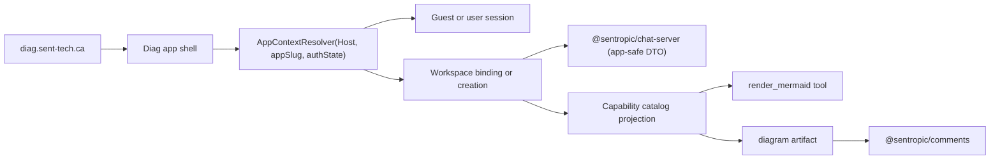
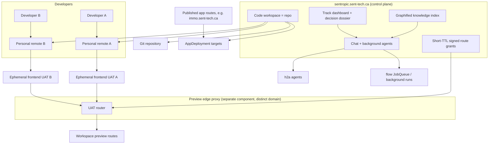
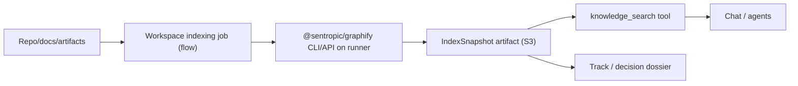
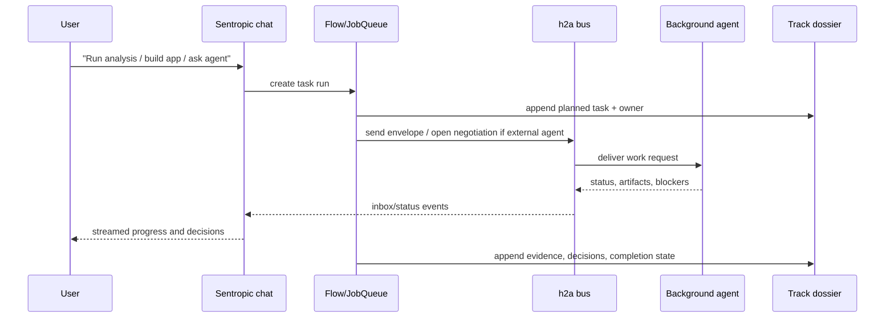
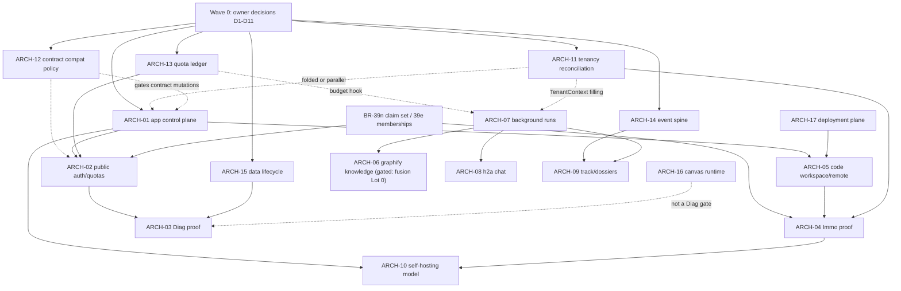

# SPEC_EVOL_ARCHITECTURE — Sentropic app/workspace/PaaS architecture tracker

Status: architecture tracking register v3, created 2026-06-07, hardened the
same day by two adversarial double reviews (round 2: Codex 5.5 xhigh + Opus
4.8; round 3: double audit of the integration, both GO-WITH-CHANGES). This
file is the coordination register for broad architecture finalities that must
be split into dedicated studies and branches. It is not an implementation
branch plan.

Owner decisions D1-D11 were taken on 2026-06-07 (section 6.3); the study
backlog is dispatchable (D10 deferred into ARCH-10).

## 1. Purpose

Sentropic is moving from a single product plus reusable packages toward a free,
self-hostable app-foundry and productivity backplane:

- `sentropic.sent-tech.ca` acts as the multi-project backoffice and coordination
  surface.
- Published apps such as `diag.sent-tech.ca` or `immo.sent-tech.ca` are
  first-class app surfaces, not route islands.
- Workspaces can represent personal spaces, business workspaces, code
  repositories, app lifecycle environments, or cross-project coordination rooms.
- Chat, background agents, h2a, remote UAT endpoints, graphified knowledge,
  track dashboards, and decision dossiers become the common productivity core.
- Any user or enterprise must be able to run, adapt, and re-offer the same
  foundation from the open codebase.

The tracking goal is to prevent each new app or integration from inventing a
private model. Diag and Immo are proofs of the same platform mechanism.

## 2. Current Baseline

Corrected after round-2 falsification against `origin/main`.

### 2.1 Shipped platform pieces

- BR-42b is merged through PR #247 (`feat/catalog-evolution-42b`). The live
  catalog supports five capability kinds (`skill`, `tool`, `agent`, `workflow`,
  `canvas`) with `search_catalog` beside stable `search_skills`. Reality check:
  it is a per-process, synchronous-snapshot in-memory registry with first-wins
  collision and no persistent DB-backed or admin-mutated control-plane
  registration — dynamic in-memory registration does exist for standalone
  tools and MCP sources (`api/src/services/catalog/composite-registry.ts`,
  `sources/standalone-tool-source.ts`, `sources/mcp-source.ts`,
  `SPEC_EVOL_CATALOG.md` §1.3/§1.4). It is a discovery surface for per-turn
  LLM tool resolution, not a control plane.
- The reusable package base is wider than chat: `@sentropic/chat-core`,
  `chat-server`, `chat-ui`, `llm-mesh`, `flow`, `skills`, `comments`,
  `auth-hono`, `auth-ui`, plus the architecture-critical ones a v1 of this
  tracker omitted: `@sentropic/auth-client` (S2S client_credentials, BR-39d),
  `@sentropic/contracts` (publishes `TenantContext` with REQUIRED `tenantId`,
  `AuthzContext`, `CostContext`, `IdempotencyKey`, `EventEnvelope`),
  `@sentropic/events`, `@sentropic/build-cli` (app manifests + embedded
  templates behind `stp app` — the actual app-foundry generator),
  `cowork-bridge`/`cowork-desktop` (device pairing + local-tool protocol), and
  `@sentropic/cli` federation (`remote`, `track`, `h2a`; graphify is federated
  as `stp knowledge`).
- Workspace model: `workspaces.type` is one of `neutral | ai-priorities |
  opportunity | code` — enforced by zod at creation, and the update route
  explicitly rejects type changes (API-immutable), but stored as plain `text`
  with no DB enum/check constraint (`api/src/db/schema.ts:17`,
  `api/src/routes/api/workspaces.ts:147-161`).
- Tenant reality: THREE divergent tenant meanings already coexist. (a) Live
  code aliases `tenantId := workspaceId`
  (`api/src/routes/api/comments.ts:22-24`); (b) OAuth tables carry a free-text
  per-client `tenant_id` plumbed but never enforced; (c) the IdP spec
  (`SPEC_EVOL_AUTH_IDP_STANDALONE.md` R7) decides global identity +
  `tenant_memberships`. Any new `Tenant` concept must reconcile all three
  (ARCH-11, D1).
- Auth: route-group `requireAuth` on most `/api/v1/*`;
  `@sentropic/chat-server` resolves `userId: 'anonymous'` when no host auth is
  supplied (`packages/chat-server/src/index.ts:360`); the standalone IdP
  `apps/auth-idp` (BR-39m A0 + A0-bis) is merged and DEPLOYED — deploy
  artifacts re-landed via PR #254 (2026-06-06) and `auth.sent-tech.ca` serves
  OIDC discovery live — but it emits NO tenant/role/membership claims yet
  (live `claims_supported` confirms; claim set = BR-39n).
- Route factory reality: only chat is a host-parameterized factory
  (`createChatServer(deps.getUser)`). The workspaces/documents/comments routers
  are module singletons hard-bound to `requireAuth` and direct `db` imports.
  "Mount the same route factories" for those three surfaces is a refactor to
  create, not an existing mount point.
- Chat wire reality: the current chat body accepts `providerApiKey`, arbitrary
  `tools`, `localToolDefinitions`, and `vscodeCodeAgent`
  (`api/src/routes/api/chat.ts:379-457`). These are privileged knobs that must
  never be mounted publicly as-is; public apps need a narrowed app-safe DTO.
- Canvas reality: `LiveDocumentStore` is a marker stub
  (`packages/chat-core/src/ports.ts`), `SPEC_EVOL_CHAT_CANVAS` is named but
  unwritten, and the live comments API restricts `contextType` to product enums
  (`organization|folder|initiative|usecase|matrix|executive_summary`) even
  though the comments package types already allow `canvas|artifact`.
- Storage: an S3-compatible artifact service exists
  (`api/src/services/storage-s3.ts`; MinIO dev / Scaleway prod).
- Events: fragmented — `execution_events`, `chat_stream_events`, Postgres
  NOTIFY channels, track external as `stp track`. The package `EventEnvelope`
  is unwired as a common spine in `api/` (though `comments` wraps its events
  in `EventEnvelope` and chat-core exposes an `EventSink`). No audit table
  exists (only chat tracing).
- Graphify: NOT a package in this repo. External `graphifyy@0.7.10` with a
  planned fusion (`plan/34-BRANCH_feat-graphify-fusion.md`, Lot 0 npm
  transfer-vs-republish fork unresolved); federated via `stp knowledge`.
  `SPEC_VOL_GRAPHIFY.md` records a non-goal "no chat-core/flow runtime usage";
  section 3.6 of this tracker EXPLICITLY SUPERSEDES that non-goal for
  workspace knowledge indexing run as flow jobs.

### 2.2 Adjacent programs this tracker must not contradict

- BR-39 IdP standalone (`SPEC_EVOL_AUTH_IDP_STANDALONE.md`): diag is ALSO the
  IdP Phase A1 onboarding proof and immo the Phase B (`tenant_memberships`)
  proof. The two roadmaps double-book the same two apps; section 4.1 resolves
  this with explicit phasing (D4).
- chat-ui modularization (COMPLETE 2026-06-07, chat-ui 0.19.0: core + 4 opt-in
  modules) + fidelity program (`SPEC_EVOL_CHATUI_MODULARIZATION.md`,
  `SPEC_EVOL_CHATUI_FIDELITY.md`): ARCH-03 UI composition builds on the
  modular core, not on a bespoke assembly.
- B2B2B trust model (`b2b2b-sentropic-eval.md`): AGENTS are non-signatory and
  act under MANDATE+BINDING; this constrains the h2a bridge (3.7) and the immo
  org-B boundary (4.2, D8).
- Cowork backend tool-driving split (server-injection + device-to-stream +
  tool-results gap): recorded after the BR-41b recette as a PLANNED dedicated
  backend branch — no remote branch exists yet, and BR-41b explicitly expected
  no backend protocol changes. ARCH-05 remote registration must reuse this
  plumbing, not create a second pairing system; confirming the split's
  owner/branch is an ARCH-05 frame question.

Note: several documents referenced by this tracker are working-tree drafts not
yet tracked on `origin/main` (`SPEC_EVOL_AUTH_IDP_STANDALONE.md`,
`SPEC_EVOL_CHATUI_MODULARIZATION.md`, `SPEC_EVOL_CHATUI_FIDELITY.md`,
`b2b2b-sentropic-eval.md`). The `chore/architecture-target` PR must either
co-commit them or keep these references annotated as drafts.

## 3. Target Concepts

Sections 3 and 4 describe the target architecture as decided by owner
decisions D1-D11 (2026-06-07, section 6.3).

### 3.1 App Templates: Control-Plane Resources with a Catalog Projection

Round-2 correction (D2): apps must NOT be modeled as a sixth in-memory catalog
kind. An app blueprint (hostnames, route mounts, auth mode, quota class,
deployment hints) is a persistent, versioned, tenant-scoped, admin-mutated
control-plane resource. The in-memory catalog physically cannot hold it: it is
synchronous, code-registered, first-wins, process-local.

Target model (k8s-CRD / Backstage-catalog style):

- `app_templates` are DB-resident declarative descriptors with desired/observed
  state and versioning;
- a thin `CatalogSource` PROJECTION exposes app entries to the capability
  catalog for LLM discoverability (`search_catalog` keeps working);
- `@sentropic/build-cli` manifests + embedded templates are the first
  app-template source — `AppTemplate` reuses or supersedes that vocabulary, it
  must not start a parallel one.

An `app` entry remains distinct from a workspace. Blueprint contents:

- identity: `appSlug` (`diag`, `immo`, `sentropic-backoffice`);
- surfaces: public hostnames, route mounts, UI shells, auth mode;
- capabilities: required skills/tools/agents/workflows/canvas templates;
- packages: `chat-ui`, `chat-server`, `comments`, auth, graphify, etc.;
- workspace bindings: allowed workspace types and default workspace template;
- deployment hints: generated app, monorepo app, external app, hosted app;
- policy defaults: quota class, anonymous allowance, marketplace visibility.

### 3.2 App Template, App Instance, Workspace, Tenant

Use separate concepts:

| Concept | Meaning | Examples |
|---|---|---|
| App template | Versioned reusable app blueprint (control-plane resource) | `diag@1.0`, `immo@1.0`, `code-workspace`, `sentropic-backoffice` |
| App instance | A deployed/available app surface bound to a tenant and environment | `diag.sent-tech.ca`, `immo.sent-tech.ca`, local generated app |
| Workspace | Recoverable state container or repo/project lifecycle container | Diag drawing workspace, Immo client workspace, repo workspace |
| Tenant | Administrative/billing/security boundary (org/account, NOT a workspace) | Sent-Tech internal, client org, self-hosted org |
| Remote | A developer-owned runtime endpoint attached to a repo workspace | Antoine dev remote, Fabien dev remote |

Tenant reconciliation (D1): tenant = org/account with workspaces below.
Identity-tenants (`tenant_memberships`) are owned by the IdP program (BR-39e,
R7); the product control plane owns resource bindings referencing them. The
live `tenantId := workspaceId` aliasing and the OAuth free-text `tenant_id`
metadata must be reconciled/migrated by ARCH-11 — `TenantContext.tenantId` is a
required field of a published npm contract, so this is a compat event, not a
rename.

The same workspace may be reachable through several app instances when policy
allows it. The same app template may create many workspaces.

Control-plane rule: Sentropic records and governs typed resources. It should not
become the runtime for every app, remote, knowledge index, or agent. Runtime work
executes through package adapters, flow jobs, registered remotes, app
deployments, h2a peers, or self-hosted providers. Sentropic stores policy,
identity, routing, audit, and event projections, and artifact pointers — note
that the audit store does not exist yet and is a named deliverable of ARCH-14.

Do not encode apps as `workspace.type`. Current workspace types are a small
product enum (API-enforced, not DB-enforced) and are immutable after creation
at the API level. Apps need app templates, instances, and workspace bindings
instead of product-type sprawl.

### 3.3 Public App Routing

Do not create app-specific API islands such as `/api/v1/diag` unless a truly
new domain object requires it. Prefer a generic public app context resolver:



Recommended route pattern, hardened round 2:

- prefer `/api/apps/:appSlug/...` for app-scoped stateful execution, with
  HOST-AUTHORITATIVE resolution: each app instance is served same-origin behind
  its own host via ingress; `AppContext` is resolved from `Host` and the path
  slug is validated against it — mismatch is a 404, never a fallback;
- guest cookies are host-only per app origin (a cross-origin API would make the
  guest cookie third-party and increasingly blocked); guest mutations need a
  CSRF story (token or double-submit);
- first middleware resolves `AppContext = tenant + appInstance + optional
  user/guest + workspace policy` (Hono middleware inside `api/`, no new service
  process);
- keep `/api/workspaces` as the authenticated console/admin workspace API;
- use `/public` only for static/bootstrap metadata, not as a stateful clone of
  existing routes;
- after app context resolution, mount chat through its existing host-auth
  factory with a NARROWED app-safe DTO (no `providerApiKey`, no arbitrary
  `tools`/`localToolDefinitions`/`vscodeCodeAgent`); workspaces/documents/
  comments first need factory extraction from their current singleton routers —
  this is refactor work owned by ARCH-02, not a free mount;
- avoid a separate Diag-specific route family.

### 3.4 Anonymous Public Mode and Claiming

Anonymous public use should create a real constrained principal, not fake a
normal user:

- guest principal: signed `guestId` in a secure host-only cookie, never the
  literal `userId: "anonymous"` fallback as a production identity;
- guest persistence (D3): guest rows live in `users` with an explicit guest
  account status and TTL cleanup. Rationale: `chat_sessions.user_id` is
  `NOT NULL` FK to `users.id` `ON DELETE CASCADE` and `comments.created_by`
  assumes `users` — a cookie-only or separate-table principal cannot own
  current artifacts without a multi-table polymorphic migration. Guest rows are
  explicitly excluded from the IdP Phase D physical `users` extraction (record
  jointly with the BR-39 owner);
- invalid auth tokens fail instead of silently becoming guest sessions;
- quota key: `(tenantId, appInstanceId, guestId, ipHash, browserIdHash,
  workspaceId, model/tool)` plus global anonymous quota — the ledger that owns
  this key is ARCH-13 (D6); `ipHash` requires the trusted-proxy/XFF posture the
  IdP spec already flags; `ipHash`+`browserIdHash` are GDPR personal data with
  retention/residency obligations (ARCH-15);
- quotas apply only to LLM-costing operations, not local rendering or static
  editing; quotas alone do not stop token-farming — per-model cost caps, a
  global anonymous circuit breaker, and a bot-mitigation stance are ARCH-13
  deliverables;
- public app users receive a policy-filtered capability projection
  (deny-by-default), not the raw catalog; arbitrary MCP, external write tools,
  user connectors, and expensive workflows require explicit policy or step-up;
- tokens and provider keys never leak to the browser;
- anonymous workspace/artifacts are marked `claimable`; claiming happens
  ACROSS the IdP OIDC round-trip: the claim token must survive the
  `authorization_code` redirect to `auth.sent-tech.ca` and be redeemed at the
  app's RP callback (RP session glue, IdP spec G2). Default mechanism:
  single-use signed JWT minted by the product API, redeemed at the RP callback
  after IdP login. Co-owned with BR-39n;
- claim moves ownership/membership without changing artifact ids. Guest-as-user
  rows make upgrade-in-place (the guest row becomes the account) a pure
  ownership transfer; claiming into an EXISTING registered account still
  re-keys `user_id`/`created_by` FK values from the guest row to the account
  row and needs an explicit merge policy — an ARCH-02 deliverable. Cascade
  cleanup of a guest row must not destroy guest-authored comments inside
  claimed workspaces: authorship transfers before deletion;
- retention and deletion policies are explicit for unclaimed guest workspaces
  (`ON DELETE CASCADE` on the guest user row gives baseline cleanup);
- enterprise/self-hosted deployments can disable anonymous mode or replace quota
  policy.

### 3.5 Code Workspace, Remote, UAT, Published App

A code workspace represents a repository and app lifecycle. It is shared by the
team, while each developer owns personal remotes. Today this exists only as
`workspaces.type='code'` plus user settings — repo binding, remote registry,
and UAT endpoints are all new resources.

```text
Project
  -> CodeWorkspace(repo)
      -> DevRemote(owner=user|service, personal, capability-scoped)
      -> UatEndpoint(remoteId, branch/ref, appId, ttl, authPolicy)
      -> AppDeployment(appId, commit/version, publicRoute)
      -> IndexSnapshot(commit/docRevision, graph artifact refs)
      -> TaskRun / AgentRun
      -> DecisionDossier
```



Rules, hardened round 2:

- workspace ownership follows repo ownership/membership;
- remote ownership follows the developer, not the workspace;
- remote registration REUSES the existing personal-runtime plumbing:
  device-code pairing (`api/src/routes/auth/device.ts`),
  `@sentropic/cowork-bridge` token lifecycle, and S2S `client_credentials`
  (BR-39d `@sentropic/auth-client`). A parallel "DevRemote" pairing protocol is
  a reuse violation;
- UAT routes are scoped by registered `(workspaceId, remoteId, branch/ref,
  appSlug, ttl, authPolicy)` endpoints, never arbitrary user-provided URLs;
- the data plane is NOT the control plane (D5): the API issues short-TTL signed
  route grants; a separate stateless edge-proxy component (separately
  deployable, self-hostable) serves previews. Proxying websockets/SSE through
  the product API would make Sentropic the runtime bottleneck — violating its
  own control-plane rule;
- developer-controlled preview content is served on a DISTINCT registrable
  domain, not `*.sent-tech.ca` (D5): origin-trust isolation next to the IdP and
  product domains (phishing surface, cookie scope, WebAuthn rpID adjacency) —
  industry standard (`*.usercontent.goog`, `*.vercel.app`);
- UAT routing must handle auth, allowlists, TTL expiry, websocket/proxy policy,
  logging, cancellation, and SSRF protection;
- published app routes are scoped by immutable `(appInstanceId, deploymentId,
  environment, tenant)` targets, not personal remotes; deployment needs a
  provider/k8s-ops contract with CRD-like desired/observed state (ARCH-17);
- Sentropic can route and observe remote frontends, but a remote must not gain
  access to other developers' private remotes by sharing the workspace.

### 3.6 Graphify as Workspace Knowledge Index

Graphify should support workspace knowledge indexing without becoming a
mandatory runtime dependency of chat or flow.

Supersession note: `SPEC_VOL_GRAPHIFY.md` records the non-goal "no
chat-core/flow runtime usage". This tracker supersedes that non-goal for ONE
pattern only: workspace indexing jobs invoked through flow. Graphify still
never becomes an import of chat/flow runtimes. The graphify fusion itself
(`plan/34`, Lot 0 npm transfer-vs-republish) is an unresolved recorded fork and
gates ARCH-06.

Recommended boundary:

- `@sentropic/graphify` remains standalone and CLI-consumable (today: external
  `graphifyy`, federated as `stp knowledge`).
- A workspace indexing job invokes graphify over repo/docs/artifacts and stores
  graph outputs as workspace knowledge artifacts. Execution locus: indexing
  runs on remotes/runners that hold the repo checkout — the control plane has
  no checkout, consistent with section 3.2.
- Artifact storage: the existing S3 service (`api/src/services/storage-s3.ts`).
- Runtime contracts are `KnowledgeIndexPort` and `KnowledgeQueryService`, backed
  by `IndexSnapshot` records.
- Chat and agents query the latest permitted snapshot through a
  `knowledge_search` or graph tool, not by importing graphify internals.
- Graph outputs are versioned by source revision, document revision, and
  workspace id.
- Snapshot permission semantics are an explicit ARCH-06 frame question:
  membership-at-snapshot-time vs membership-at-query-time, and cross-app
  exposure of the same workspace's snapshots under capability projections.
- Indexing respects ignore rules, secret classification, tenant policy, and
  output audit.
- Track and decision dossiers can link to graph nodes as evidence.



### 3.7 Chat, Background Tasks, and h2a Agents

Chat should launch background work through a unified task/run model:

- short work: chat turn tool loop;
- medium work: async tool creates an `@sentropic/flow` `JobQueue` run, returns a
  `jobRef`, and streams progress events (cancellation/retry/DLQ already exist
  on the `JobQueue` port);
- long/persistent work: h2a-backed `AgentRun` or external runner with an
  explicit capability manifest and short-lived delegated identity — delegation
  uses OAuth token exchange (RFC 8693) or a documented equivalent for the actor
  chain, not an ad hoc scheme;
- human-visible progress: track entries and decision dossier updates;
- all work carries `TenantContext`, workspace id, app context, actor chain,
  budgets (`CostContext`), policy decision, cancellation, retry, and
  dead-letter semantics; bridge messages mandate `IdempotencyKey` (both types
  already exist in `@sentropic/contracts` and are currently unwired).



Open design points, hardened round 2 (ARCH-08 frame):

- transport reality: h2a today is a filesystem bus rooted in a
  developer-local workspace, between developer CLIs; a k8s API pod has no such
  workspace. The bridge needs
  an explicit transport decision (PVC-mounted bus, sidecar, or
  protocol-over-HTTP). Define the bridge as a transport-agnostic adapter with
  the filesystem binding as dev-mode default;
- delivery semantics mismatch: Postgres lease/heartbeat/DLQ `JobQueue` vs
  append-file inboxes — reconcile at the adapter, never let chat talk directly
  to arbitrary h2a inboxes without a run record, authz, audit, and
  cancellation/escalation semantics;
- mandate model: in the B2B2B trust model AGENTS are non-signatory and act
  under MANDATE+BINDING. A user-triggered h2a send makes the product server an
  agent acting under an explicit mandate — ARCH-08 must anchor on h2a's
  MANDATE/BINDING constructs, with the server's peer identity and key custody
  defined.

## 4. First App Proofs

### 4.1 Diag

Diag is the first public anonymous-capable app proof. It is ALSO the IdP Phase
A1 onboarding proof — the two roadmaps are compatible only with explicit
phasing (D4):

- Phase 1 (platform proof): anonymous-first via guest principal, quotas, and
  capability projection — no login required;
- Phase 2 (IdP proof): diag registers as an OIDC client of `auth.sent-tech.ca`;
  login enables claim/recovery of guest workspaces.

Tracked requirements:

- public app at `diag.sent-tech.ca`;
- anonymous use without auth;
- if a user registers (at the IdP), they recover their Diag workspaces via the
  claim-token-across-redirect flow (3.4);
- Mermaid rendering through a local `render_mermaid` catalog tool —
  implementable today via `StandaloneToolSource` + the Lot-2 execution seam
  (`api/src/services/catalog/execution-seam.ts`), no new dispatch infra;
- persistence scope (D9): documents + S3 artifacts first, comments via the
  comments package after the live router's `contextType` enum is extended to
  `canvas|artifact`; the collaborative canvas/livedoc runtime is a separate
  study (ARCH-16) and NOT a Diag-proof prerequisite;
- quotas by IP + browser anonymous id + global anonymous budget, only for LLM
  calls, enforced through the ARCH-13 ledger;
- no token leak and no app-specific API island;
- uses `@sentropic/chat-server`, `@sentropic/chat-ui` (compose from the
  modular core + opt-in modules shipped in 0.19.0), `@sentropic/comments`;
- shares the same app/workspace model that later apps use.

### 4.2 Immo

Immo is the first client-facing e2e business app proof.

Tracked requirements:

- public/client app at `immo.sent-tech.ca`;
- uses proper auth, not anonymous mode by default; tenancy = IdP Phase B
  `tenant_memberships` — this is a cross-program gate (D4);
- residence (D8): immo is the B2B2B proof of an INDEPENDENT builder (org B) —
  lean separate repo, consuming published packages and the app-foundry
  lifecycle, while diag stays monorepo;
- may be generated or managed through the app-foundry lifecycle, grounded on
  `packages/build-cli` / `stp app`;
- can expose UAT frontends from developer remotes before publication;
- uses Sentropic backoffice for chat, background agents, track, and decision
  dossiers;
- should validate the B2B/B2B2B model: Sentropic provider/backoffice, client app,
  client users, and possibly client-owned self-hosting later.

### 4.3 Sentropic Backoffice

`sentropic.sent-tech.ca` remains the coordination and productivity surface:

- personal workspace for every user;
- project/repo workspaces;
- cross-project coordination workspace for Antoine;
- h2a multiproject coordination;
- track dashboards, decision dossiers, and background agent supervision;
- app catalog, app instances, workspace bindings, remotes, and deployments.

Flagship retro-modeling (D7): the existing product surfaces
(`ai-priorities`/`opportunity`/`code`) are retro-modeled as app templates, with
instance migration deferred. If the main product stays special-cased,
`AppContext` never runs on the real hot path and the abstraction is proven only
on greenfield apps — the classic abandoned-migration outcome.

## 5. Risks and Objections to Resolve

1. App and workspace can be confused. An app is a reusable surface/template; a
   workspace is state and collaboration. Mixing them will make public apps and
   repo workspaces unmanageable.
2. Anonymous mode can silently create a shadow multi-tenant model. It needs a
   real constrained principal, quota ledger, claim flow, and deletion policy.
3. Public routes can fork the platform. Diag-specific endpoints would block
   reuse by Immo/OpenERP/self-hosted apps unless they are proven domain-specific.
4. h2a in chat can bypass audit if treated as "just send inbox". It must be
   mediated through a run/task record.
5. Remote UAT routing is a security boundary. Workspace membership must not
   imply access to every developer's personal remotes.
6. Graphify can become a heavy runtime dependency if imported directly by chat.
   Keep it as an indexing producer and query via artifacts/tools.
7. Track and decision dossiers can become a second workflow runtime. They should
   observe and summarize flow/h2a/app lifecycle events, not duplicate execution.
8. Self-hosting can be lost if app-instance, quota, auth, and remote routing
   depend on Sent-Tech-specific infrastructure. Defaults must be portable.
9. Sentropic can become a "god runtime" if it owns execution instead of
   governing typed resources. Keep the control plane separate from execution
   planes.
10. Public raw catalog exposure is unsafe. Public apps need capability
    projections and invocation policy before MCP, external write tools, or
    expensive workflows are available.
11. Published app routing must not reuse UAT routing mechanics. Client apps such
    as Immo must target deployments, not personal development remotes.
12. Graphify can leak secrets or stale context if indexing ignores source
    revision, data classification, tenant policy, and output audit.

Added by round-2 review:

13. Tenant split-brain: three coexisting tenant meanings (workspace alias,
    OAuth metadata, IdP memberships) produce silent RBAC divergence if not
    reconciled before any tenant-scoped feature ships.
14. Public mounting of the current chat wire leaks privileged knobs
    (`providerApiKey`, arbitrary tools, local tool definitions).
15. Guest principals that are not `users` rows cannot own current artifacts
    (NOT NULL FKs) — any non-user design is a multi-table migration.
16. Preview content under `*.sent-tech.ca` puts untrusted developer-controlled
    HTML on the same registrable domain as the IdP — phishing and cookie-scope
    surface.
17. Free anonymous LLM calls are a token-farming target; quotas without cost
    caps, circuit breaker, and bot mitigation are insufficient.
18. Published npm contracts (`TenantContext` etc.) make tenancy changes compat
    events across `comments`/`chat-*` today (`flow` has no `contracts`
    dependency yet and would join via ARCH-07) — version policy needed before
    studies mutate them (D11, ARCH-12).
19. Event/audit infrastructure does not exist; projections (track, dossiers)
    have no spine to project from until ARCH-14 lands.
20. The flagship product staying outside the app model proves the platform only
    on toys (abandoned-migration risk).

## 6. Peer Challenge Decisions

### 6.1 Round 1 (Maxwell/Feynman) — accepted decisions

- BR-42b remains a capability catalog baseline. It does not provide app
  manifests, app instances, public guest identity, app-scoped routing, quota
  policy, or workspace migration/recovery.
- App runtime must use `AppTemplate`, `AppInstance`, `Tenant`, and `Workspace`.
  `workspace.type` must not become the app taxonomy.
- Public app execution should route through `/api/apps/:appSlug/...` with
  `AppContext`; `/public` is reserved for static/bootstrap metadata.
- Public mode uses signed guest principals, claimable workspaces, and
  policy-filtered capabilities. A literal anonymous user fallback is not a
  production identity.
- Sentropic is the typed control plane, not a god runtime. It controls policy,
  identity, routing, audit, and projections while execution stays with flow,
  remotes, deployments, h2a peers, packages, or self-hosted providers.
- UAT routes target registered `UatEndpoint` resources with TTL and auth policy.
  Published apps target `AppDeployment` resources and never personal remotes.
- Graphify produces pinned `IndexSnapshot` artifacts. Chat and agents consume a
  knowledge query service, not graphify internals.
- Chat starts durable background work through flow/task runs. h2a is integrated
  as an adapter and signed event source, not as unchecked inbox access.
- Track is a projection over events, runs, remotes, h2a messages, graph
  snapshots, deployments, and dossiers. It must not duplicate the workflow
  runtime.

### 6.2 Round 2 (Codex 5.5 xhigh + Opus 4.8) — accepted corrections

- Baseline corrected: package list completed (`auth-client`, `contracts`,
  `events`, `build-cli`, cowork pair); catalog characterized as in-memory
  discovery, not control plane; route-factory and chat-wire reality stated;
  canvas stub state stated; graphify external status stated; no audit table.
- App templates move from "sixth catalog kind" to DB control-plane resources
  with a catalog projection (D2).
- Tenant reconciliation named as a study (ARCH-11) with IdP ownership seam (D1).
- Guest-as-user-rows chosen as default (D3), jointly recorded with BR-39
  Phase D.
- Host-authoritative app routing, host-only guest cookies, CSRF posture pinned.
- Claim flow runs across the IdP OIDC redirect (BR-39n co-design).
- UAT data plane split from control plane; previews on a distinct registrable
  domain (D5).
- DevRemote registration reuses device pairing/cowork-bridge/S2S.
- `SPEC_VOL_GRAPHIFY.md` non-goal explicitly superseded; fusion fork gates
  ARCH-06; S3 storage and runner-side execution named.
- h2a bridge: RFC 8693 delegation, `IdempotencyKey` mandate, transport
  decision, MANDATE/BINDING anchoring.
- Diag/IdP double-booking resolved by dual-phase plan (D4); Diag persistence
  descoped from canvas runtime (D9).
- Studies ARCH-11..17 added; Wave 0 (owner decisions) added; wave order
  corrected (section 8).
- Study renumbering vs the raw round-2 outputs: round-2 "existing workspace
  migration" is folded into ARCH-11 + D7; v2's ARCH-16 is the canvas runtime.
  Round-2 D2 option C ("external/k8s CRD only") was restated as "config files
  only".

### 6.3 Owner decisions (D1-D11) — DECIDED 2026-06-07

Blocking decisions that gated dispatch. Recommendations were the convergent
positions of both round-2 reviewers unless noted; the packet was refined by
the round-3 audit and answered by the owner on 2026-06-07.

| ID | Decision | Options | Recommendation | Status |
|---|---|---|---|---|
| D1 | Tenant model & ownership | A workspace-as-tenant; B org/account tenant, IdP owns identity-tenants (R7/39e), product owns resource bindings; C full B2B2B federated chain now | B, designed to support C. The IdP spec already commits R7 (global identity + `tenant_memberships`), so the residual fork is product-side binding ownership + migration strategy | DECIDED B |
| D2 | App template source of truth | A sixth in-memory catalog kind; B DB control-plane resource (CRD-like) + thin catalog projection; C static config files only | B — control-plane model first, projection second; the in-memory catalog keeps its dynamic MCP/standalone sources but is never the source of truth for apps | DECIDED B |
| D3 | Guest persistence | A guest rows in `users` (explicit guest status + TTL as schema deliverables, excluded from IdP Phase D); B separate principals table + polymorphic FKs; C stateless cookie only | A. ARCH-02 owns the guest-to-existing-account merge policy (FK re-key) and authorship transfer before cascade cleanup | DECIDED A |
| D4 | IdP claims gate (a) + Diag phasing (b) — separable | (a) IdP emits tenant/role/status claims before Immo (BR-39n/39e) vs app-local auth only vs defer tenant-scoped apps; (b) Diag dual-phase (anonymous-first, then A1 OIDC client) vs login-first | B on both — answer (a) and (b) separately if you want a different Diag phasing. The IdP is now LIVE (PR #254), lowering phase-(b) cost | DECIDED B(a)+B(b) |
| D5 | UAT/preview plane & domain | A product API proxies to remotes under `*.sent-tech.ca`; B registered endpoints + signed route grants + separate stateless edge proxy on a distinct registrable domain; C no proxy | B (quasi-irreversible once preview URLs circulate). The concrete domain NAME is a Wave-0 owner deliverable | DECIDED B (domain name still open) |
| D6 | Quota/cost ledger + anonymous budget ownership | A rate limits only; B internal cost/quota ledger wiring `CostContext`, per-model caps + anonymous circuit breaker + bot posture; C external billing now | B, billing later. Owner-only sub-decision: who funds anonymous spend, the monthly cap, and kill-switch authority | DECIDED B (budget ownership framed in ARCH-13) |
| D7 | Flagship retro-modeling | A existing product surfaces become app templates (instance migration deferred); B app model for new apps only | A (B calcifies a permanent special case) — gated on ARCH-01 producing a migration cost estimate before any instance moves | DECIDED A |
| D8 | App residence (diag/immo) | A both monorepo `apps/`; B immo separate repo (org-B B2B2B proof), diag monorepo; C immo monorepo spike first, extracted once package/app-foundry contracts stabilize | B; C acceptable as a stepping stone if the extraction milestone is committed | DECIDED B |
| D9 | Diag persistence scope | A write canvas/livedoc runtime first (ARCH-16); B ship Diag on documents+S3 without CRDT, ARCH-16 separate | B | DECIDED B |
| D10 | Licensing/marketplace posture for FUTURE app templates (current packages stay MIT; no retro-relicensing) | A MIT-everything; B dual-license/commercial templates allowed; C decide after a marketplace/third-party contribution policy study | open — strategy; gates ARCH-10 and third-party templates only, not platform dispatch | DECIDED C (deferred to ARCH-10) |
| D11 | Published-contract compat policy (`@sentropic/contracts`, `comments`, `chat-*`) | A additive-only; B breaking changes allowed with major bump + migration notes; C compatibility shims | B with additive-preferred; no study lands a `contracts` mutation before ARCH-12 frames the policy | DECIDED B |

### 6.4 Round-2 reversible defaults (in force after D1-D11, change-on-evidence)

- `/api/apps/:appSlug` kept, slug validated against `Host`; mismatch = 404.
- Quota ledger as a Postgres table (no Redis) — D6=B confirmed; enforcement
  only on LLM-costing operations.
- `render_mermaid` ships via `StandaloneToolSource` + existing execution seam.
- `IndexSnapshot` artifacts stored through the existing S3 service.
- `AppContextResolver` as Hono middleware inside `api/`.
- Claim token = single-use signed JWT minted by the product API, redeemed at
  the RP callback after IdP login.
- Keep `/api/v1/*` console routes unchanged; app routes added through an
  adapter.
- Use `@sentropic/contracts` types; per D1=B, new code must not hard-couple
  `tenantId` to `workspaceId`.
- Start with a Postgres outbox/projections before external event
  infrastructure.
- `@sentropic/build-cli` embedded templates as first app-template source.
- Keep `search_catalog`; project apps into it only after control-plane
  resources exist.
- OAuth token exchange (RFC 8693) for agent delegation unless a better
  standard is explicitly chosen.
- Public capability projection is deny-by-default.
- Track stays cross-repo (`@sentropic/track`) per the federation manifest until
  ARCH-09 proves otherwise.
- h2a bridge defined transport-agnostic; filesystem-bus binding as dev default.
- DevRemote registration prototyped on device-code pairing + `auth-client` S2S
  before any new protocol.

## 7. Study Backlog

| ID | Study | Output | Key questions |
|---|---|---|---|
| ARCH-01 | App control-plane model + catalog projection | SPEC_EVOL_APP_CATALOG | Control-plane model FIRST, projection second; `app_templates`/`app_instances`/`tenants` resources; build-cli manifest reuse; which DB owns them (product vs IdP seam, with D1); migration cost estimate for flagship retro-modeling (D7) |
| ARCH-02 | Public app auth and anonymous quotas | SPEC_EVOL_PUBLIC_APP_AUTH | Guest principal rows (D3); guest-to-existing-account merge policy (FK re-key + authorship transfer); claim-across-OIDC-redirect with BR-39n; cookie/CSRF/origin model; app-safe chat DTO + factory extraction of workspaces/documents/comments routers |
| ARCH-03 | Diag public app proof | SPEC_EVOL_DIAG_APP | Mermaid tool via execution seam; documents+S3 persistence (D9); comments `contextType` extension; chat-ui modular-core composition; claim UX; retention |
| ARCH-04 | Immo e2e app proof | SPEC_EVOL_IMMO_APP | IdP Phase B membership gate; org-B residence (D8); app-foundry generation via build-cli; UAT-to-published lifecycle; B2B2B disclosure boundaries |
| ARCH-05 | Code workspace + remote UAT routing | SPEC_EVOL_CODE_WORKSPACE_REMOTE | Repo binding; remote registration on device-pairing/cowork-bridge/S2S; confirm cowork backend split owner/branch; route-grant + edge proxy protocol; preview domain; personal-remote isolation |
| ARCH-06 | Graphify workspace knowledge | SPEC_EVOL_WORKSPACE_KNOWLEDGE | Gated on graphify-fusion Lot 0; snapshot permission semantics; incremental rebuilds; query API; ignore/secret policy; artifact retention |
| ARCH-07 | Chat-launched background work | SPEC_EVOL_BACKGROUND_AGENT_RUNS | Run schema vs existing `execution_runs`; progress channel reuse (stream events); `TenantContext` filling before ARCH-11 lands; budget hook to ARCH-13 |
| ARCH-08 | h2a chat integration | SPEC_EVOL_H2A_CHAT | Bus transport in k8s; server peer identity + key custody; RFC 8693 delegation; MANDATE/BINDING anchoring; failure/resume semantics |
| ARCH-09 | Track and decision dossiers | SPEC_EVOL_TRACK_DECISION_DOSSIER | Depends on ARCH-14 spine; track residence (cross-repo `stp track` vs in-product); dossier schema; human decision model |
| ARCH-10 | Self-hosting and re-offer model | SPEC_EVOL_SELF_HOSTED_SENTROPIC | Mandatory components for a self-host (IdP? control plane? edge proxy?); licensing (D10); telemetry defaults; upgrade channel. Wave-1 annex: portability constraints (no Sent-Tech-only domains, pluggable quota/abuse, no managed-cloud-only deps) |
| ARCH-11 | Tenant/identity/membership reconciliation + migration | SPEC_EVOL_TENANCY | Unify the three tenant meanings; `tenant_memberships` seam with BR-39e; backfill existing workspaces (default tenant, `ADMIN_WORKSPACE_ID`); re-key vs grandfather stored `tenantId:=workspaceId` data |
| ARCH-12 | App template lifecycle + contract versioning | SPEC_EVOL_APP_TEMPLATE_LIFECYCLE | Wave-1 scheduled: no published-contract mutation lands before ARCH-12 frames the D11 policy; template versioning/upgrades/compat; semver impact on published `@sentropic/contracts`/`comments`/`chat-*` (and `flow` once it adopts contracts) |
| ARCH-13 | Quota/cost/billing ledger + abuse posture | SPEC_EVOL_QUOTA_LEDGER | Ledger schema + ownership; `CostContext` wiring; per-model caps; global anonymous circuit breaker; XFF/trusted proxy; bot mitigation; GDPR retention of guest identifiers |
| ARCH-14 | Event spine, audit, observability | SPEC_EVOL_EVENT_SPINE | `EventEnvelope` producer/outbox/projection ownership; audit table; OpenTelemetry; replay/retention; reconcile `execution_events`/`chat_stream_events`/NOTIFY |
| ARCH-15 | Data residency, retention, export/deletion | SPEC_EVOL_DATA_LIFECYCLE | Guest retention; tenant deletion/export; self-host portability of data policies; GDPR lawful basis for quota identifiers |
| ARCH-16 | Canvas/LiveDocument runtime | SPEC_EVOL_CHAT_CANVAS | CRDT vs snapshot model; `LiveDocumentStore` port; comments on canvas/artifact; NOT a Diag-proof prerequisite (D9) |
| ARCH-17 | Deployment control plane + edge proxy | SPEC_EVOL_DEPLOYMENT_PLANE | `UatEndpoint`/`AppDeployment` desired/observed state; provider/k8s-ops contract; domains/TLS/rollback; route-grant format; SSRF/websocket policy |

## 8. Suggested Branch Grouping

Do not implement this whole file as one branch. Dispatch studies first, then
convert to branch plans.



Dispatch order, corrected rounds 2-3:

- Wave 0: owner decisions D1-D11 (TAKEN 2026-06-07; D10 deferred into
  ARCH-10), the concrete preview-domain name (D5 — still open), plus framing
  notes for ARCH-11/12/13/14 and the ARCH-10 portability-constraints annex
  (one page, constrains all Wave-1 defaults).
- Wave 1 study: ARCH-01 (with ARCH-11 folded or parallel), ARCH-07 (promoted —
  depends only on flow + chat tool loop, both exist), ARCH-12 (no
  published-contract mutation lands before it), ARCH-13, ARCH-14.
- Wave 2 study: ARCH-02 (gated on BR-39n/39e decisions), ARCH-05 (coordinate
  with the planned cowork backend split), ARCH-15 (gates Diag's GDPR posture),
  ARCH-17, ARCH-06 (gated on graphify-fusion Lot 0, consumes the ARCH-07 run
  model), ARCH-08 (after ARCH-07).
- Wave 3 app proofs: ARCH-03 Diag and ARCH-04 Immo after app/auth/remote
  decisions are stable enough; ARCH-16 runs independently and does not gate
  Diag.
- Last: ARCH-09 (needs ARCH-14 spine + real event sources), full ARCH-10.

## 9. Review Log

- 2026-06-07: Created after user request to track the cross-cutting
  app/workspace/PaaS architecture and to challenge the Diag/public-app framing
  against broader Sentropic goals.
- 2026-06-07: BR-42b checked as merged via PR #247; this tracker treats BR-42b
  as baseline and proposed `app` as the next catalog kind (superseded by round
  2: control-plane resource + catalog projection).
- 2026-06-07: Round 1 — integrated peer challenges from Maxwell and Feynman
  into the control-plane, app-context, public guest, remote UAT, graphify, h2a,
  and track guardrails.
- 2026-06-07: Round 2 — double adversarial review (Codex 5.5 xhigh: NO-GO
  as-was; Opus 4.8: GO-WITH-CHANGES). Seven falsifications fixed against
  `origin/main` (route-factory reality, tenant triple meaning, guest FK
  constraints, catalog substrate, canvas stub state, graphify supersession,
  package-list omissions). App-as-catalog-kind reworded to control-plane
  resource + projection. Studies ARCH-11..17 added. Wave 0 owner-decision gate
  added. Diag/IdP double-booking resolved by dual-phase plan.
- 2026-06-07: Round 3 — double audit of the integrated v2 (Codex 5.5 xhigh +
  Opus 4.8, both GO-WITH-CHANGES). Fixed: catalog dynamic in-memory sources
  nuance; IdP deploy is LIVE (PR #254, `auth.sent-tech.ca` serving OIDC
  discovery, still no tenant claims); cowork backend split is planned, not
  in-flight; `EventEnvelope` partially wired via comments; `flow` has no
  `contracts` dependency; guest claim "no FK rewrite" narrowed to
  upgrade-in-place with an explicit merge-policy deliverable;
  `workspaces.type` update-route wording; ARCH-06/07 dependency reversed;
  ARCH-12/15 scheduled into waves; sections 3-4 marked recommended-pending;
  defaults requalified as proposed/contingent; D4 marked separable, D8 renamed
  app residence with spike option, D6 extended with budget ownership, D10
  scoped to future templates, D11 (contract compat policy) added; h2a bus path
  generalized; untracked sibling-document references annotated for the PR.
- 2026-06-07: Owner decisions D1-D11 taken: D1=B, D2=B, D3=A, D4=B(a)+B(b),
  D5=B (preview-domain name still a Wave-0 deliverable), D6=B (anonymous
  budget ownership framed in ARCH-13), D7=A, D8=B, D9=B, D10=C (deferred into
  ARCH-10), D11=B. Study backlog unblocked for dispatch.
