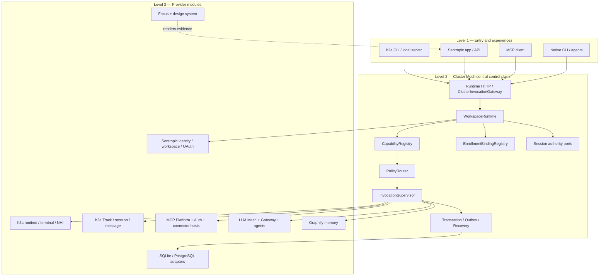
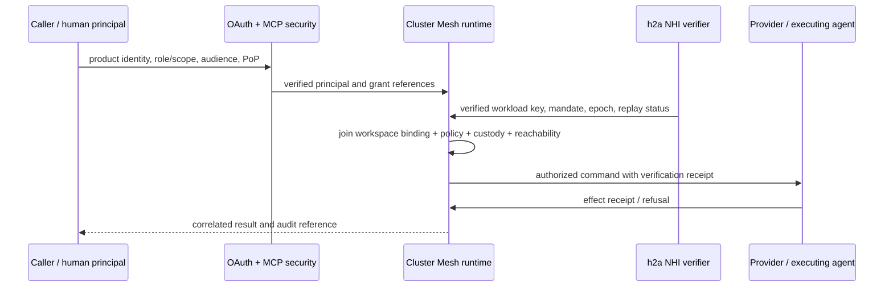

# Cluster Mesh Central Control Plane — Evolution Specification

## Status and authority

- Status: **accepted r8 architecture, build specification**.
- Owner acceptance: `2026-08-29`; choices D1=C, D2=C, D3=A, D4=C, D5=C, D6=A, D7=C, D8=baseline, D9=C, D10=security chapter without a wire-profile choice, D11=C, D12=C.
- Decision source of truth: `.tmp/focus-cluster-mesh-decision-kit/dossier.json` at revision `2026-08-29-r8`.
- Acceptance and r8 amendments: `.tmp/engage/cluster-mesh-shared-core-owner-feedback-r8.json` and the owner's build instruction that created this specification.
- Supporting synthesis: `.tmp/engage/cluster-mesh-shared-core-synthesis-r7.md`.
- Archived immutable evidence: `docs/specs/decisions/cluster-mesh-r8/`.

The archived r8 JSON still contains the pre-acceptance workflow marker `owner-input-required` and the earlier D1 open-boundary warning. Those fields are historical evidence, not the current decision status. The r8 feedback says that the dossier is accepted as a reference, and the owner's present instruction ratifies D1=C while supplying the missing per-library and MCP-runtime boundaries. This specification is the closure artifact; it does not rewrite the archived evidence.

## Reading convention

- **CURRENT** means behavior verified in the named repository at the pinned source location.
- **TARGET** means behavior required by this accepted specification and not yet claimed as shipped.
- **COMMITTED EXTERNAL DESIGN** means a ratified provider design whose implementation/release gates remain owned by another repository.
- **FORBIDDEN INFERENCE** means that an architectural diagram or target name is not evidence of current implementation.

Repository-relative locators refer to Sentropic. Absolute locators are read-only evidence in the h2a and Graphify repositories. JSON source locators use stable decision identifiers because the dossier is archived verbatim.

## Objective

Create one neutral control plane through which h2a, the Sentropic application, MCP clients, and native agents invoke workspace capabilities. The minimum useful slice centralizes an h2a invocation through `WorkspaceRuntime`, `CapabilityRegistry`, and `PolicyRouter`; subsequent slices converge MCP, sessions, persistence, memory bindings, shared enrollments, security enforcement, and the accepted architecture renderer on the same runtime.

The target is a **control plane**, not a new owner for every provider's semantics. Cluster Mesh owns cross-provider workspace binding, routing, policy, invocation lifecycle, transactions, receipts, enrollment bindings, and authority transfer. MCP, LLM Mesh, Focus, Track, Graphify, and the host-local h2a runtime retain their provider semantics and are composed behind neutral contracts.

## Non-goals

- No federation, distributed consensus, or general exactly-once execution claim.
- No second memory engine, Graphify schema, graph snapshot format, or ranking implementation.
- No second MCP protocol/auth implementation and no permanent broker bypass.
- No transfer of terminal process custody into the application.
- No application mirror for a `LOCAL_ONLY` data domain.
- No dual-writer session mode and no offline reconciliation of concurrent writers.
- No selection in this specification of JOSE/JCS, DSSE, COSE/CBOR, HPKE, group-key, or other D10 wire profile.
- No direct source change to the external h2a or Graphify repositories from this Sentropic branch.

## Evidence baseline

| Area | CURRENT evidence | Consequence for the TARGET |
|---|---|---|
| Cluster Mesh | `packages/cluster-mesh/README.md` describes a degenerate single-instance v1 and gated federation seams; `packages/cluster-mesh/src/mesh.ts:createDegenerateClusterMesh` composes membership, trust, device, boundary, projection, and memory-replication seam objects only. | Evolve the package into the neutral runtime; never label the current package a central control plane. |
| Application adapter | `api/src/services/cluster-mesh-adapter.ts:createAppClusterMeshAdapter` stores workstations in a process-local `Map` and exposes tenant-scoped membership/device/boundary methods. | Replace process-local control state with injected, mode-aware stores and expose the runtime through the adapter. |
| MCP ingress | `api/src/routes/api/mcp.ts` authenticates and resolves connector hosts directly; its sample MCP resource surface is gated off. | Make runtime HTTP ingress the first hop and compose MCP Platform/Auth as an internal runtime module. |
| MCP authoring | `packages/mcp-auth/src/core.ts:verifyMcpAccessToken` implements OAuth audience, tenant, scope, and DPoP checks; `packages/mcp-platform/src/runtime.ts` authors MCP session, consent, enrollment, and connector context contracts. | Reuse these packages; Cluster Mesh coordinates them but does not re-author their protocol or security semantics. |
| MCP durability | `packages/mcp-platform/src/persistence.ts` provides mock/in-memory/file-test persistence; `packages/mcp-broker/src/broker.ts` is a private proof with direct provider dispatch. | Add injected durable adapters, absorb useful broker orchestration behind the MCP module, then remove the bypass/proof path. |
| Connector execution | `packages/connector-host/src/mount.ts:mountConnectorHost` mounts provider adapters per workspace; `packages/mcp-platform/src/runtime.ts:StpConnectorContext` carries verified references but can resolve secrets directly through a port. | Route connector effects through the central invocation supervisor while retaining connector-owned codecs and secret ports. |
| LLM enrollment | `packages/llm-mesh/src/enrollment/contracts.ts` defines enrollment/provider contracts; `packages/llm-mesh/src/routing-policy.ts:InMemoryRoutePolicyProfiles` has one active in-memory profile; `api/src/services/llm-account-transports.ts` separately implements app-side provider enrollment and refresh. | Make LLM Mesh the shared enrollment authority, add global-then-workspace policy and singular custody, and retire parallel app semantics after cutover. |
| Sessions | `api/src/db/schema.ts` defines durable app chat sessions/messages/stream events; h2a `packages/remote-protocol/src/types.ts:RemoteEventEnvelope` defines host session events; h2a `packages/h2a-runtime` owns terminal/session execution. | Bind both surfaces to one authority-mode state machine without moving terminal custody out of h2a. |
| h2a identity and messages | h2a `packages/h2a/src/runtime/identity/workspace-id.ts` derives a durable repository workspace ID; `identity/bindings.ts` records fenced local bindings; `signature.ts` and `envelope.ts` provide Ed25519 sign/verify primitives; `replay.ts` is memory-only. | Reuse the host identity/message baseline, extract only neutral references, and add durable replay/mandate enforcement before remote action. |
| Track | h2a `packages/track/README.md` and `src/events/store.ts` define an append-only, hash-chained, single-writer file log. | Keep Track provider-owned; move toward the accepted SQLite-prime plus branch-merge dump target through a provider contract, never an app mirror in `LOCAL_ONLY`. |
| Graphify memory | h2a `docs/specs/2026-08-15-SPEC_STUDY_memory-core-graphify-max.md` defines `GraphifyMemoryPortV2`; Graphify `spec/SPEC_EVOL_AGENT_MEMORY_SUBSTRATE.md` defines the committed `graphify-memory` contracts, canonical store, SQLite/Postgres adapters, authorization, and activity-evidence boundary. The physical package is not yet present in Graphify. | Pin and reuse the published Graphify contract after its L0–L7 gates; until then implement only a provider-neutral capability fixture and fail closed for activation. |
| Focus renderer | `packages/focus/src/model.ts` and `render/html.ts` support dossier snapshots and fenced diagram fallback; the accepted kit's `.tmp/focus-cluster-mesh-decision-kit/src/ArchitectureCanvas.svelte`, `ArchitectureNode.svelte`, `ArchitectureEdge.svelte`, and `architecture-routing.js` contain the richer architecture renderer using the published design system and XYFlow. | Reverse the generic model, routing, and components into the canonical Sentropic Focus package; do not publish decision-specific scene content as a generic API. |

## Accepted decisions

| Decision | Owner choice | Accepted requirement and justification |
|---|---|---|
| D1 — Runtime ownership | **C** | Cluster Mesh owns all cross-provider control domains behind one runtime, with the stopping rule specified below. This prevents alternate orchestration paths while preserving provider authorship. The current narrow runtime is evidenced by `packages/cluster-mesh/src/mesh.ts`; the exact target boundary comes from r8 D3 and D6. |
| D2 — Workspace authority | **C** | Bind repository authority and product-workspace authority explicitly. h2a already has durable repository IDs and fenced bindings (`workspace-id.ts`, `bindings.ts`); the app supplies tenant/workspace authority through `api/src/services/cluster-mesh-adapter.ts`. A mapping is required; neither identifier silently replaces the other. |
| D3 — Capitalization | **A** | Perform maximal reasoned capitalization now: extract genuinely neutral contracts, contract-first evolving seams, and compose already separated providers. This minimizes duplicated semantics without pretending unfinished provider designs are shipped. |
| D4 — Persistence | **C** | Select persistence by data-domain semantics and authority mode. A `LOCAL_ONLY` domain has exactly one host-local writer and no application mirror. Application PostgreSQL mirror/ledger exists only for `APP_MANAGED` remote control. Host inbox and delivery metadata are SQLite-first. |
| D5 — Agent identity | **C** | Use linked principals: human/product identity, workload/NHI identity, short-lived mandate, and terminal custody are distinct references. h2a carries the NHI proof until the normative OAuth/MCP/NHI join is defined. This avoids treating a courier, a user session, and an executing agent as the same authority. |
| D6 — MCP runtime placement | **A** | Integrate `mcp-platform` and `mcp-auth` fully as the internal MCP module of Cluster Mesh. Offer the resulting capability to h2a. The first hop is MCP client → Cluster Mesh runtime HTTP → internal MCP module → connector/provider. Direct API-to-connector and permanent `mcp-broker` paths are forbidden after cutover. |
| D7 — Session authority | **C** | Support both `LOCAL_ONLY` and `APP_MANAGED` with a fenced authority transfer. `LOCAL_ONLY` has one host writer. `APP_MANAGED` has the application ledger as canonical, absorbs transcript/journal/payload events, and uses a derived PC inbox/spool. Adopt/detach requires epoch, checkpoint, and high-water fencing. |
| D8 — Memory baseline | **Baseline, not a new choice** | Reuse the existing h2a↔Graphify contract and the committed Graphify memory substrate. Cluster Mesh binds and invokes memory; it does not own canonical memory, ranking, Graphify schemas, or rebuild logic. Activation waits for the external contract/release gates. |
| D9 — Architecture view | **C** | Use a renderer-neutral architecture model plus adapters. The branch must reverse the accepted kit's generic `ArchitectureView`, node/edge components, and deterministic routing into Focus and published design-system primitives. Scene-specific dossier data remains documentation evidence, not a general library contract. |
| D10 — Security | **Chapter; no profile decision** | Freeze the authority and verification invariants, diagram the proof chain, and map controls to NIST SP 800-63-4 and SP 800-207. OAuth+MCP carry product identity, roles, and MCP security; h2a carries NHI proof until the normative join. Do not choose a serialization, signature, recipient-encryption, or credential profile here. |
| D11 — MCP enrollment | **C** | Support per-host and shared connector instances through explicit workspace bindings, consent/grant/revocation, non-secret auth references, proof of possession where required, and one active custodian. MCP Platform authors both enrollment forms; Cluster Mesh binds and routes them. |
| D12 — LLM enrollment | **C** | LLM Mesh is the shared enrollment authority. Store non-secret descriptors centrally, evaluate global policy then workspace policy, and enforce one credential custodian per account and epoch. Transfer is fenced; raw secret copying is never the fallback. |

## D1/D3 ownership and capitalization boundary

The runtime owns a domain when it must coordinate more than one provider or authority surface. A provider keeps a domain when its semantics remain meaningful without Cluster Mesh. Runtime-owned state is limited to neutral identifiers, bindings, policy decisions, command/event/receipt metadata, transaction/outbox state, authority epochs, and audit correlation.

| Library/domain | TARGET action | Ownership stopping rule | CURRENT locator |
|---|---|---|---|
| `capability-contract` | Extract now into `@sentropic/contracts`. | Neutral capability ID, descriptor, request, result, and error only; no MCP tool or LLM-provider DTO. | `packages/contracts/src/index.ts`; `packages/cluster-mesh/src/mesh.ts` |
| `workspace-binding-contract` | Extract now into `@sentropic/contracts`. | Carries repository/product references and binding epoch; resolution remains in host/app adapters. | h2a `workspace-id.ts`, `bindings.ts`; `api/src/services/cluster-mesh-adapter.ts` |
| `identity-reference` | Extract now into `@sentropic/contracts`. | DTO-only linked references; no token validation, credential minting, or NHI attestation. | `packages/contracts/src/index.ts`; `packages/mcp-auth/src/core.ts`; h2a `packages/h2a/src/types.ts` |
| `secure-agent-message` | Contract first. | Neutral verification inputs/results and mandate references; wire profile remains open under D10. | h2a `envelope.ts`, `signature.ts`, `replay.ts` |
| `event-contract` | Contract first in `@sentropic/events`/contracts. | Correlation, causation, idempotency, epoch, receipt, and payload codec reference; provider owns payload schema. | `packages/events/src/index.ts`; h2a `remote-protocol/src/types.ts` |
| `persistence-contract` | Contract first with host SQLite and app PostgreSQL adapters. | Ports describe authority and atomicity; no universal storage model or cross-mode mirroring. | `packages/mcp-platform/src/persistence.ts`; `api/src/db/control-schema.ts` |
| MCP Platform/Auth | Compose as the runtime's internal MCP module. | MCP protocol, OAuth verification, consent, connector session, and elicitation semantics remain MCP-authored. | `packages/mcp-platform/src/runtime.ts`; `packages/mcp-auth/src/core.ts` |
| LLM Mesh/Gateway | Compose as providers. | Enrollment, route selection, account preparation, and LLM streaming remain LLM-authored. | `packages/llm-mesh/src/service/facade.ts`; `packages/llm-gateway/src/ports/*.ts` |
| Focus | Compose as a presentation provider; reverse generic architecture rendering into it. | Focus owns deterministic document/view rendering, not runtime policy. | `packages/focus/src/index.ts`; accepted kit `src/ArchitectureCanvas.svelte` |
| Track | Compose as an activity provider. | Track owns its event log, hash chain, codecs, and local writer; core sees evidence/cursors only. | h2a `packages/track/src/events/store.ts`, `src/ingest/contract.ts` |
| Graphify memory | Contract first, then bind the separately published provider. | Graphify owns canonical memory, ranking, graph/vector projections, revalidation, and retention semantics. | Graphify `SPEC_EVOL_AGENT_MEMORY_SUBSTRATE.md:CanonicalMemoryStorePort`; h2a memory study `GraphifyMemoryPortV2` |
| `h2a-runtime` | Remains host-local. | Terminal/PTY lifecycle, local process custody, peer transport, and host session execution do not move into Sentropic. | h2a `packages/h2a-runtime/package.json`; `packages/h2a-runtime/src/**` |

## Three-level target architecture



All effectful entry paths cross Level 2. Level 3 providers may call one another only through a capability registered with the runtime or through a provider-internal call that has no cross-workspace/control-plane effect. A provider authoring boundary is not an invocation bypass.

## Minimum centralized h2a slice

The first executable target slice is deliberately small:

1. Resolve the durable repository workspace reference and optional product-workspace binding.
2. Create a verified linked-principal context without copying tokens or h2a private keys.
3. Resolve one registered, read-only h2a capability through `CapabilityRegistry`.
4. Apply `PolicyRouter`, including workspace, authority mode, custody installation, and reachability facts.
5. Execute through `InvocationSupervisor` with idempotency, correlation, event, receipt, and audit records.
6. Return the provider result without introducing MCP, memory, or remote write semantics into the slice.

This slice proves centralization and stopping rules before the broader providers are cut over. It does not claim that the external h2a checkout has been released against the new package; cross-repository consumption remains a publication/compatibility gate.

## D6 internal MCP module

The only production MCP effect path is:

```text
MCP client
  -> Cluster Mesh HTTP ingress
  -> WorkspaceRuntime binding and linked-principal context
  -> internal MCP Auth verification
  -> internal MCP Platform session/consent/enrollment module
  -> PolicyRouter and InvocationSupervisor
  -> Connector Host / provider
  -> transaction, receipt, audit, and response
```

`mcp-auth` remains the source of OAuth resource/audience/scope/tenant/DPoP validation. `mcp-platform` remains the source of MCP session, consent, enrollment, elicitation, cancellation, and connector-context semantics. Cluster Mesh supplies the HTTP first hop, workspace binding, cross-provider policy, transaction boundary, and audit. The current direct route in `api/src/routes/api/mcp.ts` and the private proof dispatch in `packages/mcp-broker/src/broker.ts` must be retired after conformance tests demonstrate one path.

## D7 session authority model

| Mode/state | Canonical writer | Host state | App state | Effect rule |
|---|---|---|---|---|
| `LOCAL_ONLY` | Host-local h2a runtime | Canonical SQLite/local provider store and terminal custody | No transcript, journal, payload, or derived mirror | Local effects may execute after host verification; app has no remote-control authority. |
| `ADOPTING` | Previous writer until fenced checkpoint commits | Flushes semantic events, records checkpoint/hash and high-water mark, pauses old epoch | Prepares new ledger epoch and acknowledges import | No new effect crosses the authority boundary until the epoch transfer receipt commits. |
| `APP_MANAGED` | Application PostgreSQL ledger | SQLite-first inbox/spool and derived live metadata only; terminal custody remains local | Canonical commands, semantic events, receipts, recoverable transcript/journal/payloads | Every terminal or remote input is an app-ledger command before actuation. |
| `DETACHING` | App until fenced checkpoint commits | Prepares new host epoch from acknowledged checkpoint | Stops issuing commands, records final high-water mark and transfer receipt | Offline control resumes only after singular authority transfers. |

Delivery is at least once. Ledger insertion and effect handling are idempotent. `homeEpoch`, command identity, correlation/causation IDs, checkpoint hash, high-water marks, and effect receipts fence repeats and stale writers. Raw PTY bytes may be explicitly ephemeral or bounded/redacted; any content presented as reconstructible conversation must be a semantic durable event in the canonical writer.

## D4 persistence matrix by data domain

The mode column selects the writer; storage technology follows domain semantics. “Mirror” below never means an unfenced second writer.

| Data domain | `LOCAL_ONLY` | `APP_MANAGED` | Authority/invariant |
|---|---|---|---|
| Repository workspace identity and binding | Host-local SQLite/JSONL migration source; host is sole writer; **no app mirror** | App PostgreSQL binding is canonical for product authority; host keeps only a fenced binding cache needed to connect | Repository and product IDs remain distinct and epoch-bound. |
| Runtime capability registry and policy snapshot | Host-local SQLite for local runtime; **no app mirror** | PostgreSQL canonical policy/binding revision, SQLite read cache allowed | A decision records the exact policy and binding revisions used. |
| Invocation, transaction, outbox, receipt, audit | Host-local SQLite; host sole writer; **no app mirror** | PostgreSQL ledger/outbox canonical; host stores delivery acknowledgements only | Commit record precedes external effect; recovery is fail closed and idempotent. |
| Track activity | Provider-owned SQLite-prime target plus append-only branch-merge dump; **no app mirror** | Provider remains source; app may store explicit remote-control evidence references/cursors, not a copied Track log | Track retains one writer, hash chain, and provider codec. |
| h2a session transcript/journal/payload | Host-local canonical provider store; **no app mirror** | Not canonical on host; supplied to the app ledger as semantic events | Exactly one authority mode and writer per `sessionId/homeEpoch`. |
| App-managed session command/event ledger | Absent | PostgreSQL canonical | Commands, semantic events, receipts, checkpoint, and high-water marks are transactional. |
| Host inbox/spool and live metadata | SQLite-first local delivery structure | SQLite-first, derived from app ledger and disposable after acknowledgement/rebuild | Never promoted to a second canonical transcript. |
| MCP enrollment/binding/consent | Host-local SQLite for local custodian; **no app mirror** | PostgreSQL canonical non-secret descriptor/binding/consent ledger | Secrets remain with the declared custodian; references carry epoch/revision. |
| LLM account enrollment, routing, custody | Host-local SQLite descriptor/policy for local-only account; **no app mirror** | PostgreSQL canonical non-secret descriptor and policy; custodian may remain host-local | One custodian per account/epoch; transfer requires fencing or reauthentication. |
| Graphify canonical memory | Graphify SQLite canonical store; **no app mirror** | Graphify-managed PostgreSQL only when the provider contract and deployment mode select it | Cluster Mesh stores binding, cursor/checkpoint reference, invocation, and receipt only. |
| Secure-message replay and mandate status | Durable host SQLite verifier state; **no app mirror** | PostgreSQL verifier ledger plus bounded host delivery cache | Replay, expiry, revocation, epoch, and audience are checked before action. |
| Raw credentials, private keys, terminal handles | Custodian-local secret/key/process facilities; **no app mirror** | Stay at the declared custodian; app stores non-secret references | No secret copying as reconciliation or enrollment fallback. |

## D8 exact h2a / Sentropic / Graphify split

| Owner | Responsibilities | Explicit exclusions |
|---|---|---|
| h2a | Host-local runtime, terminal custody, repository workspace evidence, local session writer, NHI/message proof baseline, Track activity production, `ScopeGrant`/activity inputs to the memory adapter. | Does not become a remote application ledger, OAuth authority, or Graphify memory engine. |
| Sentropic / Cluster Mesh | Neutral workspace/capability/identity references, verified invocation context, provider binding, cross-provider policy, transaction/outbox/audit, app-managed ledger, Graphify capability adapter, receipt/cursor references. | Does not parse Graphify internals, rank memories, own Track codecs, or duplicate h2a terminal/session execution. |
| Graphify | `graphify-memory` contract, canonical store, authorization admission/revalidation, episode semantics, ranking, graph/vector projections, retention and rebuild. | Does not parse h2a coordination registries, product roles, OAuth tokens, or Cluster Mesh policy syntax. |

The integration must reuse the existing h2a `GraphifyMemoryPortV2` conception and map it to the versioned Graphify public contract. Before Graphify publishes the contract and passes its L0–L7 gates, this branch may ship neutral capability fixtures and fail-closed adapter scaffolding only. It must not freeze a substitute DTO or claim production activation. Compatibility is pinned by package version and contract fixture digest.

## D11 connector enrollment and D12 LLM enrollment

Both enrollment families use the same neutral binding structure: `workspaceRef`, `accountRef/connectorRef`, `providerRef`, `custodyInstallationRef`, `authorityMode`, `bindingRevision`, `homeEpoch`, `policyRefs`, `reachability`, and non-secret auth status. Provider packages extend this neutral record with provider-owned descriptors.

- MCP Platform authors per-host and shared connector instance semantics, consent, scopes, revocation, session, and proof-of-possession requirements.
- LLM Mesh authors provider enrollment, account preparation, quota/routing facts, and availability.
- Cluster Mesh binds those descriptors to a workspace, evaluates global policy before workspace policy, selects the reachable declared custodian, and records invocation/receipt/audit evidence.
- A local-custody account is shown as unavailable from the app when its custodian is unreachable.
- When a destination cannot mint or receive an independent credential, require reauthentication or keep execution at the original custodian. Do not silently copy a secret.

## D5/D10 security chapter

### Authority chain



OAuth and MCP carry product identity, roles/scopes, resource audience, tenant, and MCP-facing proof-of-possession. h2a carries the non-human workload identity, host key proof, and current signed-envelope baseline until a normative join profile is separately decided. Cluster Mesh joins references and verified results; it does not equate a bearer, courier, user, workload, mandate, or terminal custodian.

| Verification layer | Required before action | Failure behavior | Standards anchor |
|---|---|---|---|
| Human/product identity | Authenticator/session assurance context, subject, tenant, role/scope, resource audience | Reject actionable request; read-only degradation requires an explicit policy | NIST SP 800-63-4 digital identity assurance model |
| Workload/NHI | Stable subject reference, current key proof, attested binding when available, key status | Reject unknown, stale, revoked, or falsely attested workload | NIST SP 800-207 subject/device/workload-aware policy enforcement |
| Mandate | Issuer, subject, workspace, capability/action, audience, issued/expiry time, delegation depth, policy/binding revision | Reject expired, over-broad, stale-revision, or unauthorized delegation | SP 800-207 least privilege and continuous evaluation |
| Message integrity | Versioned canonical bytes/profile reference, sender proof, recipient/audience, correlation, causation, idempotency, epoch | Verify before act; courier delivery is never authorization | Profile deliberately left open by D10 |
| Replay and revocation | Durable replay key/status, command state, mandate/key/account revocation, custody epoch | Fail closed when required status is unavailable | SP 800-207 continuous verification |
| Effect custody | Singular reachable custodian, capability policy, transactional command/receipt | No effect on ambiguous custody or writer epoch | D4/D7/D11/D12 accepted invariants |
| Confidentiality | Transport protection now; recipient/payload confidentiality only after a selected profile and key-discovery model | Do not label transport-only encryption end-to-end | Profile deliberately left open by D10 |

The build may expose profile-neutral verification ports and adapt the current h2a Ed25519 primitive, but it must not publish that custom canonicalization as the cross-language standard. No remote actionable capability is enabled until required verification, durable replay/revocation, transaction, and negative conformance vectors pass. D10 remains a sedimented chapter, not an implicit profile decision.

## D9 Focus renderer reversal

The accepted kit demonstrates a useful architecture view, but `.tmp` is evidence, not a product source directory. The target extracts:

- renderer-neutral scene, node, edge, port, status, and overlap-report contracts into `packages/focus/src/architecture/`;
- deterministic orthogonal routing and collision verification into renderer-neutral TypeScript;
- `ArchitectureView`, `ArchitectureNode`, and `ArchitectureEdge` Svelte adapters into a Focus subpath, built from published `@sentropic/design-system-svelte` primitives/tokens and XYFlow behind optional UI dependencies;
- DOM/unit/golden fixtures that prove deterministic layout and zero node/label overlap;
- package exports and semver release metadata.

Decision-specific r8 scenes, prose, and options stay in the archived dossier/kit evidence. Focus receives reusable components and neutral fixtures only. The canonical Sentropic `packages/focus` package is the destination; the duplicate h2a checkout consumes the published package after release instead of becoming a second source.

## Transition and compatibility rules

1. Land neutral contracts before runtime implementations; every contract has a version and compatibility fixture.
2. Prove the minimum read-only h2a slice before enabling MCP, session, enrollment, or memory effects.
3. Introduce a single runtime HTTP ingress and cut each provider over behind conformance tests.
4. Remove the prior effect path in the same cutover lot; no permanent dual route or feature-flag fallback.
5. Create at most one application migration for the control-plane schema.
6. Migrate metadata and non-secret references first. Existing secrets stay with their current custodian.
7. Activate `APP_MANAGED` writes only after ledger/outbox/recovery and authority-transfer tests pass.
8. Keep `LOCAL_ONLY` host-only. An application projection of that data is a contract violation, not an optimization.
9. Gate Graphify activation on its published release, contract digest, and L0–L7 exit evidence.
10. Gate remote actionable messages on the future D10 profile decision; the current branch implements invariants and denial paths without choosing the profile.
11. Publish Focus renderer components from Sentropic before changing any external h2a consumer.
12. Cross-repository consumer upgrades are release coordination against the committed Sentropic package SHAs, not hidden edits from this branch.

## Convergence invariants

1. Every effectful entry surface reaches one `WorkspaceRuntime` and one `InvocationSupervisor` before provider execution.
2. Every durable namespace has one canonical writer for a given authority mode and epoch.
3. `LOCAL_ONLY` means host-local sole writer and no application mirror.
4. `APP_MANAGED` session control means application PostgreSQL ledger canonical and host SQLite inbox/meta derived.
5. Repository workspace identity and product workspace identity are explicitly bound and never conflated.
6. Identity references, mandates, message proofs, custody, and transport are separate layers.
7. Verify-before-act includes audience, scope/action, workspace binding, policy revision, replay, revocation, epoch, custody, and reachability.
8. Delivery is at least once; idempotent transaction/effect handling replaces any exactly-once claim.
9. Provider payloads remain opaque to the core except for versioned neutral envelope metadata.
10. MCP protocol/auth/session/consent/enrollment semantics stay authored by MCP Platform/Auth even though the module is runtime-internal.
11. LLM Mesh is the single LLM enrollment authority; application code is an adapter, not a parallel authority.
12. Track remains provider-owned and single-writer; Cluster Mesh consumes evidence/cursors, not Track internals.
13. Graphify alone owns canonical memory, ranking, projections, final eligibility revalidation, and rebuild semantics.
14. h2a runtime and terminal custody remain host-local.
15. No raw secret moves merely to deduplicate an enrollment or transfer execution.
16. No D10 message/credential/encryption profile is silently selected by implementation.
17. The generic ArchitectureView lives in canonical Focus and uses the design system; dossier-specific scenes do not become library API.
18. Current, target, and committed-external-design claims remain labeled and evidence-located.

## Acceptance criteria

- One read-only h2a capability crosses the central runtime with a versioned workspace binding, linked-principal context, policy decision, invocation record, and receipt.
- MCP HTTP ingress reaches the internal MCP module only through Cluster Mesh, and conformance tests prove no direct connector bypass.
- `LOCAL_ONLY` and `APP_MANAGED` session UAT proves singular writer authority, adopt/detach fencing, restart recovery, duplicate delivery handling, and absence of a local-only app mirror.
- Persistence tests prove atomic command/outbox/receipt behavior and deterministic recovery for every implemented adapter.
- Graphify compatibility tests use the published provider contract/digest or remain fail-closed when its release gate is unmet.
- MCP and LLM enrollment tests prove explicit bindings, global-then-workspace policy, singular custody, reachability truth, revocation, and no secret copying.
- Security negative vectors prove rejection of wrong audience/workspace, stale epoch/policy, expired/revoked mandate, replay, ambiguous custody, and unavailable verifier status.
- Focus renderer tests prove deterministic routing, zero reported node/label overlap for golden scenes, DS-based component rendering, and stable package exports.
- No implementation is merged without independent Gemini 3.7 max review and explicit owner GO.

## Source ledger

- Accepted decision snapshot: `docs/specs/decisions/cluster-mesh-r8/dossier.json` (r8 decision IDs D1–D12).
- Accepted architecture/security/persistence synthesis: `docs/specs/decisions/cluster-mesh-r8/synthesis-r7.md`.
- Owner evolution trail: `docs/specs/decisions/cluster-mesh-r8/owner-feedback-r6.json`, `owner-feedback-r7.json`, `owner-feedback-r8.json`.
- Current Sentropic core: `packages/cluster-mesh/src/mesh.ts`, `trust.ts`, `projection.ts`, `memory.ts`.
- Current app boundary: `api/src/services/cluster-mesh-adapter.ts`, `api/src/routes/api/mcp.ts`, `api/src/db/control-schema.ts`, `api/src/db/schema.ts`.
- Current provider boundaries: `packages/mcp-auth/src/core.ts`, `packages/mcp-platform/src/runtime.ts`, `packages/mcp-platform/src/persistence.ts`, `packages/mcp-broker/src/broker.ts`, `packages/connector-host/src/mount.ts`, `packages/llm-mesh/src/enrollment/contracts.ts`, `packages/llm-mesh/src/routing-policy.ts`, `packages/llm-gateway/src/ports/`.
- Current Focus boundary and accepted renderer evidence: `packages/focus/src/`; `.tmp/focus-cluster-mesh-decision-kit/src/ArchitectureCanvas.svelte`, `ArchitectureNode.svelte`, `ArchitectureEdge.svelte`, `architecture-routing.js`, and `dist/architecture/manifest.json`.
- h2a read-only evidence: `/home/antoinefa/src/h2a/packages/remote-protocol/src/`, `packages/h2a/src/runtime/identity/`, `packages/h2a/src/envelope.ts`, `signature.ts`, `replay.ts`, `packages/h2a-runtime/`, `packages/track/`, and `docs/specs/2026-08-15-SPEC_STUDY_memory-core-graphify-max.md`.
- Graphify read-only evidence: `/home/antoinefa/src/graphify/spec/SPEC_EVOL_AGENT_MEMORY_SUBSTRATE.md`.
