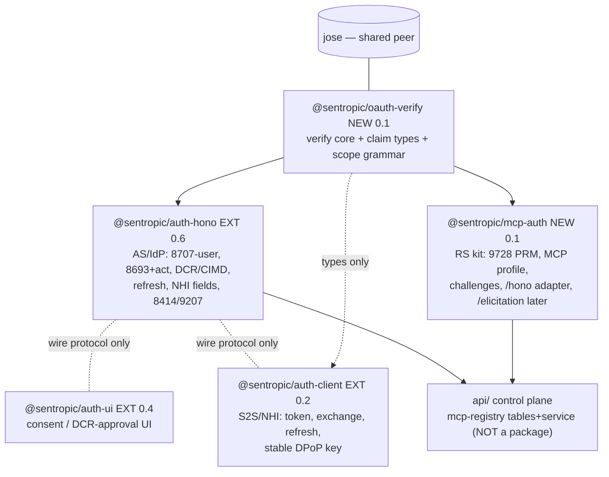

# SPEC STUDY — BR-39* MCP/NHI/multi-tenant auth: librarization decomposition (adversarial)

Status: STUDY (planning-only, 2026-06-11). No code. Baseline = `main` working tree.
Builds on: `spec/SPEC_STUDY_39_MCP_AUTHKIT_ELICITATION_GAPS.md` (capability gaps + lots 39l-mcp-authz / 39h+39-nhi-bridge / 39l-dcr / 39i⊕39e-Lot5 / 39m-mcp-registry / 39q-elicitation).
Mission: challenge the conductor-lane's proposed package mapping and produce the refined `@sentropic/*` split: boundaries, public API surfaces, dependency DAG, semver impact, escalations.
Constraint honored: IdP↔h2a seam stays opaque (`act.h2a_eng` = uninterpreted reference). Package-boundary decisions are PROPOSALS — final cut is the Transversal Architect's (`codex:sentropic`); the escalation set is §8.

Evidence read (code, not roadmap): `packages/auth-hono/{package.json,src/index.ts,src/ports.ts,src/oauth/{token-handler,service-auth-middleware,dpop,jwks-service,wellknown-handler,state-store-types}.ts}` (0.5.0), `packages/auth-client/src/index.ts` (0.1.0), `packages/auth-ui/package.json` (0.3.2), `packages/contracts/src/index.ts` (0.1.1), `api/src/middleware/auth.ts` + `api/src/routes/auth/service-s2s.ts` (the only in-repo `createRequireServiceAuth`/auth-client consumers), `rules/architecture.md` (extraction-by-real-consumption), `spec/SPEC_EVOL_DATA_ARCHITECTURE.md` (DD6 incubate-unpublished precedent), `spec/SPEC_EVOL_RESOURCE_FS.md` (§2/§3 catalog/mount evidence), mcp-authkit README (fetched).

---

## 0. Verdict summary — what changed vs the conductor draft

| Draft proposal | Verdict | Change |
|---|---|---|
| EXTEND `@sentropic/auth-hono` (8707-user-flow, 8693+`act`, DCR/CIMD, NHI types, refresh) | **KEEP** — right home (AS/IdP side) | But: 39h `identities` TABLE FUSION deferred (additive `identityType` instead — avoids a forced 1.0); auth-hono must also **shed** its duplicated RS-verify code (finding F1) |
| EXTEND `@sentropic/auth-client` | **KEEP** | Plus a missed requirement: **stable/injectable DPoP keypair** (today ephemeral per-process — breaks NHI attestation-on-register, finding F4) |
| EXTEND `@sentropic/auth-ui` | **KEEP** (minor) | No change |
| NEW `@sentropic/mcp-auth` (one package: PRM + validation + elicitation hooks) | **RESHAPED** | PRM + validation stay together; **elicitation/credential-vault deferred to an unfrozen subpath** (39q); the **verification core is extracted below it** (new `@sentropic/oauth-verify`) so auth-hono and mcp-auth share ONE implementation (finding F1/F2) |
| NEW `@sentropic/mcp-registry` | **KILLED as a package** | One real consumer (api control plane); per `rules/architecture.md` extraction-by-consumption + DD6 precedent → **api/ control-plane code**, candidate later layer of the Resource Plane non-published package (BR-70). Only the **scope grammar constants** are shareable → they live in `oauth-verify` (finding F3) |
| Thin `@sentropic/h2a-auth-bridge` (maybe) | **KILLED as a package** | Code-free convention confirmed. The only code is a claim TYPE (`ActClaim` with opaque `h2a_eng`) → lives in `oauth-verify` types. Shipping a "codec" package would invite semantic validation and erode the seam (finding F5) |
| (implied) `@sentropic/auth-contracts` types package | **NOT CREATED** | Claim/identity types live in `oauth-verify` (bottom of the DAG, no cycle). Folding into existing `@sentropic/contracts` rejected for the same reason DD6 rejected it for the UBO envelope: auth-claim churn (MCP draft is a moving target) would version-event comments/events/chat-core consumers (finding F6) |

**Recommended package set (final, one-line scopes):**

1. `@sentropic/oauth-verify` — NEW. Framework-free, jose-peer-only verification core: access-token verify (pluggable key source: remote JWKS or local port), DPoP proof verify, scope assertion, `WWW-Authenticate` challenge builder, canonical claim/identity types (`AccessTokenClaims`, `ActClaim`, `IdentityType`, MCP scope grammar constants).
2. `@sentropic/mcp-auth` — NEW. The "freedom-of-use" MCP resource-server kit: RFC 9728 PRM serving, MCP-profile token validation (audience=resource URI, DPoP, `tid` hook), 401/403 challenge semantics with `resource_metadata`; `./hono` adapter; `./elicitation` subpath deferred (39q).
3. `@sentropic/auth-hono` — EXTENDED (0.5→0.6 minor): RFC 8707 on the user flow, RFC 8693 token-exchange + `act`, DCR(7591)/CIMD, refresh tokens for `native|mcp` clients, additive NHI identity fields + enforcement, RFC 8414 alias + RFC 9207 `iss`; internals delegate to `oauth-verify` (duplicates deleted).
4. `@sentropic/auth-client` — EXTENDED (0.1→0.2 minor): token-exchange, refresh, stable/injectable DPoP key, NHI registration helper.
5. `@sentropic/auth-ui` — EXTENDED (0.3→0.4 minor): DCR approval + consent surfaces; elicitation verify page later (39q).
6. mcp-registry — **NOT a package**: api/ control-plane schema + service (39m), co-designed with Resource Plane BR-70.
7. h2a bridge — **NOT a package**: convention + `ActClaim` type in `oauth-verify`.

---

## 1. Adversarial findings against the draft (the evidence)

**F1 — The duplication the draft worries about already exists INSIDE auth-hono, three times.** `service-auth-middleware.ts:101-134` (`verifyAccessToken`: kid → `JwksPort.findKeyByKid` → `importJWK` → `jwtVerify` iss+aud) re-implements `jwks-service.ts:86-100` (`verifyJwt`, same pipeline); and `service-auth-middleware.ts:191-238` (`verifyServiceDpopProof`) is a near-line-for-line copy of `dpop.ts:34-93` (`verifyOAuthDpopProof`) differing only in port shape (`ServiceAuthPorts` vs `AuthHonoPorts`) and error class. A fresh `@sentropic/mcp-auth` with its own validation would create the **fourth** copy of security-critical verify code. Conclusion: the RS package must not "reuse-or-duplicate auth-hono" — both must consume a single extracted core. This is "real reorg, not hook patches": MOVE the code, delete the duplicates (no-legacy-fallback rule).

**F2 — RS validation is NOT a pure duplicate of `createRequireServiceAuth`: the key source differs, and that difference is the real package boundary.** Today's `ServiceAuthPorts.jwks: JwksPort` (`state-store-types.ts:105-109`) is a **DB-backed** port (`getActiveKey/findKeyByKid/listPublicKeys`) — fine for the IdP-colocated api/, **unusable by an external/enterprise MCP server**, which can only reach our keys via HTTPS (`/.well-known/jwks.json`, jose `createRemoteJWKSet` semantics). So the genuinely new RS code is: remote-JWKS key source with cache/rotation, PRM serving, and `resource_metadata`-bearing challenges. The verification *after key resolution* (jwtVerify iss/aud, DPoP htm/htu/jti/iat/ath/jkt, scope assert) is identical on both sides → shared core with a `TokenKeySource` port and two adapters (`fromRemoteJwks`, `fromJwksPort`).

**F3 — mcp-registry fails the extraction-activation test.** `rules/architecture.md`: "Package extraction must be activated by real app consumption... not architecture-only scaffolding." The registry (rows `(tenant_id, server_url, prm_url, client_binding, allowed_scopes, mount_policy, attestation_ref)`) has exactly ONE consumer: the api control plane (catalog `McpCatalogSource` + mount authz, `SPEC_EVOL_RESOURCE_FS.md` §2/§3). External parties never run our registry — they run `mcp-auth` on their server. DD6 (data architecture) is the governing precedent: incubate in-repo, defer publication until a second consumer exists. Resource-Plane DD decisions already mandate a **separate non-published package** for resolver/catalog — if BR-70 wants the registry projection there, fine, but that is BR-70's cut, not 39m's. What IS cross-package: the **MCP scope grammar** (issued by auth-hono, validated by mcp-auth, declared in PRM) → constants in `oauth-verify`.

**F4 — The draft misses an auth-client breaking gap: ephemeral DPoP keys.** `auth-client/src/index.ts:91-97` mints a fresh EdDSA keypair per process (`dpopKeyPromise ??= generateKeyPair('EdDSA')`). 39h attestation-on-register binds an NHI identity to a key (proof-of-possession at registration); a per-restart key makes the attested `jkt` worthless. auth-client 0.2 needs `dpopKey?: { privateKey, publicJwk }` injection (or a `DpopKeyStorePort`) — additive, but it must be co-designed with the 39h attestation flow, not bolted on after (contract-consumer co-design rule).

**F5 — The h2a bridge must stay code-free beyond a type.** Any "codec" (encode/decode/validate `h2a_eng`) is the first step toward the IdP interpreting engagements. The whole contract is: `act: { sub, iss?, h2a_eng?: string }` where `h2a_eng` is a non-empty string the IdP stores/echoes and policy can require *presence* of, never *validity* of. That is a type + one presence check inside auth-hono's exchange handler. No package, no helper exports beyond the type.

**F6 — Do not fold claim types into `@sentropic/contracts`.** `contracts@0.1.1` is the transverse chat/app types package (TenantContext, AuthzContext, IdempotencyKey, EventEnvelope) consumed by comments/events/chat-core. Auth claims will churn with the MCP **draft** spec; per the DD6 reasoning ("every envelope iteration becomes a contracts version event for comments/chat-*"), claim types live in `oauth-verify` — the bottom of the auth DAG, consumed by auth-hono (issuer), mcp-auth (validator) and auth-client (type-only). No cycle: `oauth-verify` imports nothing sentropic.

**F7 — Semver isolation argues for TWO new packages, not one.** The MCP authorization spec is a draft; PRM fields, challenge params, CIMD details WILL move. If `mcp-auth` contained the verify core and auth-hono depended on it, every MCP-draft churn would ripple version events into the IdP's dependency tree (4 prod RP consumers pin auth-hono). With `oauth-verify` (stable: RFC 9449/7519 verification doesn't churn) below both, `mcp-auth` can iterate as a leaf. This is the strongest argument vs the one-package fallback; the counterargument (each package = a publish pipeline + trusted-publisher setup + compat-matrix cost — real, per the npm-publish memory) is acknowledged → escalation E1.

**F8 — `createRequireServiceAuth` inside auth-hono was always a boundary anomaly.** It is RS-side code hosted in the IdP package, justified only because no RS package existed (BR39d-D6 created the narrow port precisely to fake the split). Target end-state: the canonical RS middleware lives in `@sentropic/mcp-auth/hono`; auth-hono keeps `createRequireServiceAuth` as a thin wrapper over `oauth-verify` primitives (signature unchanged → non-breaking) for ≥1 minor, then drops at 1.0. Only in-repo consumer to migrate: `api/src/middleware/auth.ts` + `api/src/routes/auth/service-s2s.ts`.

**Comparison with mcp-authkit:** authkit bundles Leg-1 (JWT middleware + RFC 8414 meta router) and Leg-2 (elicitation credential providers + storage backends) in one Python lib. We deliberately ship Leg-1 only in `mcp-auth` v1 and defer Leg-2 to the `./elicitation` subpath after 39q design (freezing a credential-vault API now, before the elicitation spec study lands a real consumer, repeats the 39b lesson). authkit's `ContextVar current_user` ≈ our `McpAuthContext` returned per-request; authkit's storage modes (memory/Fernet-file/redis) ≈ our future `ThirdPartyCredentialStorePort` (BYO adapters).

---

## 2. Package: `@sentropic/oauth-verify` (NEW)

**Scope:** framework-free OAuth2/OIDC *verification* core + canonical claim types. Peer dep: `jose` only. Runs anywhere fetch+WebCrypto runs (Node, workers, edge). Zero Hono, zero zod, zero storage.

**Boundary verdict:** justified ONLY because it has ≥3 real consumers at birth: auth-hono (refactor deletes F1 duplicates), mcp-auth, api/ (via either). If the architect rejects the two-package cut, the fallback is: this entire surface becomes the ROOT export of `@sentropic/mcp-auth` and auth-hono depends on `mcp-auth` (accepting F7's churn coupling + the IdP-depends-on-"mcp" naming smell). Name is owner-validated at publication (durable-naming rule); `oauth-verify` is the provider-neutral default.

**Public API:**

```ts
// ---- claim & identity types (canonical home) ----
export type IdentityType = 'user' | 'service' | 'agent' | 'nhi' | 'mcp_connector';
export interface ActClaim { sub: string; iss?: string; h2a_eng?: string; act?: ActClaim } // h2a_eng OPAQUE
export interface AccessTokenClaims extends JWTPayload {
  client_id?: string; scope?: string; tid?: string;
  cnf?: { jkt?: string }; act?: ActClaim; identity_type?: IdentityType;
}
// MCP scope grammar constants (aligned RF discover/read/invoke; final strings = lane + owner naming check)
export const MCP_SCOPES: { TOOLS_INVOKE: string; RESOURCES_READ: string; DISCOVER: string };

// ---- key sources (THE seam between in-process and remote RS) ----
export interface TokenKeySource { resolve(header: { kid?: string; alg?: string }): Promise<CryptoKey | Uint8Array> }
export const keySourceFromJwksPort: (port: JwksPortLike) => TokenKeySource;   // IdP-colocated (api/)
export const keySourceFromRemoteJwks: (opts: {
  issuer: string; jwksUri?: string; cacheTtlSeconds?: number; fetch?: FetchLike;
}) => TokenKeySource;                                                          // external RS (discovery + cache)

// ---- verification ----
export interface VerifyAccessTokenOptions {
  issuer: string | string[]; audience: string | string[];
  keySource: TokenKeySource; now?: () => Date; requiredScopes?: string[];
}
export const verifyAccessToken: (token: string, opts: VerifyAccessTokenOptions) => Promise<AccessTokenClaims>;

export interface DpopReplayPort { recordDpopJti(jti: string, expiresAt: Date): Promise<boolean> }
export interface VerifyDpopProofOptions {
  proof: string; htm: string; htu: string; accessToken?: string; expectedJkt?: string;
  iatSkewSeconds?: number; replay?: DpopReplayPort; now?: () => Date;
}
export const verifyDpopProof: (opts: VerifyDpopProofOptions) => Promise<{ jkt: string; jti: string }>;

export const parseScopes: (scope: unknown) => string[];
export const assertScopes: (granted: string[], required: string[]) => void; // throws insufficient_scope

// ---- errors & challenges (RFC 6750 + 9728 params) ----
export class OAuthVerifyError extends Error { status: 401 | 403; code: string; scheme: 'Bearer' | 'DPoP' }
export const buildWwwAuthenticate: (input: {
  scheme: 'Bearer' | 'DPoP'; error?: string; errorDescription?: string;
  scope?: string; resourceMetadata?: string;                                  // resource_metadata=<PRM URL>
}) => string;
```

**Reuse audit (what moves in, what is deleted at origin):** `dpop.ts:verifyOAuthDpopProof` + `service-auth-middleware.ts:verifyServiceDpopProof` → ONE `verifyDpopProof` (replay via optional port — covers both AS-side `oauthStateStore.recordDpopJti` and RS-side `dpopReplay`); `service-auth-middleware.ts:verifyAccessToken` + `jwks-service.ts:verifyJwt`'s kid-lookup path → `verifyAccessToken` over `keySourceFromJwksPort`; `parseScopes/assertScopes/buildWwwAuthenticate` lifted and generalized (current builder lacks `scope`/`resource_metadata` params). `jwks-service` signing side (`signJwt/getPublicJwks`) STAYS in auth-hono — issuance is AS-only.

**Deps:** peer `jose`. **Semver:** new 0.1.0; aims for fast stabilization (verification RFCs are frozen); contract test = token fixtures signed by a test Ed25519 JWKS, verified bidirectionally with auth-hono (see §7).

---

## 3. Package: `@sentropic/mcp-auth` (NEW)

**Scope:** everything an MCP **resource server** (ours or a third party's) needs to be MCP-authorization-draft compliant against any spec-compliant AS (ours included): PRM, audience-bound token validation with MCP profile, DPoP, tenant hook, challenge semantics. BYO host: root export is fetch-style (`Request`→`Response`), adapters per framework.

**Boundary verdict — the three sub-questions:**
- *(a) one package or split (PRM vs validation vs elicitation)?* PRM and validation MUST cohabit: the 401 challenge's `resource_metadata` URL points at the PRM the same server publishes, and one `McpAuthConfig` (resource URI, AS list, scopes) feeds both — splitting them creates config drift between what the PRM advertises and what the validator enforces (exactly the class of drift F1 shows we breed). Elicitation is split OFF in time, not in package: `./elicitation` subpath, API **not frozen** in v1 (39q lands it with a real MCP-server consumer). mcp-authkit's one-lib shape confirms the cohabitation; its Leg-2 confirms elicitation belongs RS-side (vault on the MCP server, never the IdP, never transiting the client).
- *(b) duplicate of `createRequireServiceAuth`?* No — see F1/F2: both delegate to `oauth-verify`; mcp-auth adds what auth-hono's middleware lacks (PRM, remote keys, `resource_metadata` challenges, `tid` hook) and eventually rehomes the RS middleware entirely (F8).
- *(naming)* `mcp-auth` optimizes external discoverability (the freedom-of-use audience searches "mcp auth"); kept from the draft, subject to owner naming validation.

**Public API:**

```ts
import type { AccessTokenClaims, ActClaim, TokenKeySource } from '@sentropic/oauth-verify';

export interface McpAuthConfig {
  resource: string;                        // canonical resource URI = the token audience (single-aud model)
  authorizationServers: string[];          // PRM authorization_servers
  scopesSupported?: string[];
  keySource?: TokenKeySource;              // default: keySourceFromRemoteJwks(authorizationServers[0])
  requireDpop?: boolean;                   // mandatory for NHI-grade servers
  requireTid?: boolean | ((tid: string | undefined, claims: AccessTokenClaims) => boolean | Promise<boolean>);
  resourceDocumentation?: string;
}
export interface McpAuthContext {
  sub: string; clientId: string; scopes: string[];
  tid: string | null; jkt: string | null; act: ActClaim | null; claims: AccessTokenClaims;
}
export interface McpAuth {
  metadata(): ProtectedResourceMetadata;   // RFC 9728 document
  handle(req: Request): Promise<Response | null>; // serves /.well-known/oauth-protected-resource; null = pass through
  verify(req: Request, opts?: { requiredScopes?: string[] }): Promise<McpAuthContext>; // throws McpAuthError
  challenge(error: unknown): Response;     // 401 WWW-Authenticate resource_metadata+scope / 403 insufficient_scope
}
export const createMcpAuth: (config: McpAuthConfig) => McpAuth;
```

```ts
// '@sentropic/mcp-auth/hono'  (hono = optional peer)
export const mcpAuthRoutes: (mcp: McpAuth) => Hono;                       // mounts the PRM well-known
export const requireMcpAuth: (mcp: McpAuth, opts?: { requiredScopes?: string[]; contextKey?: string })
  => MiddlewareHandler;                                                   // successor of createRequireServiceAuth
```

```ts
// '@sentropic/mcp-auth/elicitation'  — DEFERRED to 39q; NOT frozen in v1. Sketch only:
export interface ThirdPartyCredentialStorePort { /* get/put/delete keyed by (iss, sub, tid?, provider) */ }
export const verifyElicitationAssertion: (jwt: string, opts: { keySource: TokenKeySource; issuer: string })
  => Promise<{ sub: string; eid: string }>;  // IdP-signed connect-URL sub-match assertion
```

**Third-party consumption, framework-agnostic (~10 lines):**

```ts
import { createMcpAuth } from '@sentropic/mcp-auth';

const mcp = createMcpAuth({
  resource: 'https://mcp.example.com',
  authorizationServers: ['https://auth.sent-tech.ca'],
  scopesSupported: ['mcp:tools:invoke'],
});
export async function fetchHandler(req: Request): Promise<Response> {
  const wellKnown = await mcp.handle(req);          // RFC 9728 PRM + scheme pre-checks
  if (wellKnown) return wellKnown;
  const auth = await mcp.verify(req, { requiredScopes: ['mcp:tools:invoke'] })
    .catch((e) => { throw mcp.challenge(e); });     // 401/403 with resource_metadata
  return serveMcp(req, auth);                        // auth.sub / auth.tid / auth.act available
}
```

Hono variant (Sentropic-internal MCP servers / enterprises on Hono):

```ts
import { mcpAuthRoutes, requireMcpAuth } from '@sentropic/mcp-auth/hono';
app.route('/', mcpAuthRoutes(mcp));
app.use('/mcp/*', requireMcpAuth(mcp, { requiredScopes: ['mcp:tools:invoke'] }));
```

**Deps:** `@sentropic/oauth-verify` (dep), `jose` (peer), `hono` (optional peer, `/hono` only). **Semver:** new 0.1.0; expected to churn with the MCP draft (leaf position makes that safe, F7). Publish-time dist per the chat-ui lesson; functional harness = a real token round-trip against an auth-hono test IdP, not "it compiles".

---

## 4. Package: `@sentropic/auth-hono` (EXTENDED, 0.5.0 → 0.6.0)

**Boundary verdict:** the draft's cut is right — all AS/IdP-side: 8707-user-flow, 8693+`act`, DCR/CIMD, refresh, NHI enforcement, 8414/9207. Two corrections: (1) it must simultaneously SHED the F1 duplicates (depend on `oauth-verify`, delete `verifyServiceDpopProof` + `verifyAccessToken` copies; keep `createRequireServiceAuth` as a thin signature-stable wrapper until 1.0 per F8); (2) the 39h `oauth_clients`+`service_clients`→`identities` **table fusion is deferred** — additive `identityType` fields deliver every actual requirement (type, DPoP-mandatory enforcement, `h2aRef`, offboard) without a breaking port reshape; the fusion (auth-hono 1.0) waits for a real need the additive shape cannot meet (the roadmap itself warned against premature unification).

**Public API additions (all additive; existing exports unchanged):**

```ts
// ports / records (state-store-types.ts) — additive optional fields & methods
interface OauthClientRecord { /* + */ clientKind?: 'web' | 'native' | 'mcp';
  identityType?: IdentityType; h2aRef?: string | null; allowRefreshTokens?: boolean;
  resourceIndicators?: string[];                       // RFC 8707 allowlist, user-flow }
interface ServiceClientRecord { /* + */ identityType?: IdentityType; h2aRef?: string | null }
interface AuthCodePayload   { /* + */ resource?: string | null }      // carried authorize→token
interface OauthStateStorePort {                        // optional methods, findServiceClient? precedent
  saveRefreshToken?(hash: string, payload: RefreshTokenPayload, ttlSec: number): Promise<void>;
  rotateRefreshToken?(hash: string): Promise<RefreshTokenPayload | null>;  // single-use, atomic
  revokeRefreshChain?(chainId: string): Promise<number>;
  registerClient?(input: ClientRegistrationInput): Promise<OauthClientRecord>;   // DCR persistence
}
interface AuthHonoTrustedIssuerPort {                  // NEW optional port (39i⊕39e-Lot5)
  findTrustedIssuer(iss: string, tenantId: string | null): Promise<TrustedIssuerRecord | null>;
  // record: { iss, jwksUri, scopeIntersection: string[], ttlCapSeconds, tenantId }
}

// handlers (new factories, same pattern as createOAuthTokenHandler)
export const createOAuthTokenExchangeHandler: (opts: {
  issuer: string; ports: AuthHonoPorts; trustedIssuers?: AuthHonoTrustedIssuerPort;
  requireH2aRefForNhi?: boolean;          // presence-only check on act.h2a_eng — never interpreted
}) => (c: Context) => Promise<Response>;  // RFC 8693; emits act:{sub,iss,h2a_eng} chain
export const createOAuthRegistrationHandler: (opts: {
  issuer: string; ports: AuthHonoPorts;
  policy: { allow(input: ClientRegistrationInput): Promise<RegistrationDecision> };   // gated DCR
  cimd?: { fetch?: FetchLike; cacheTtlSeconds?: number };                               // CIMD resolver
}) => (c: Context) => Promise<Response>;  // RFC 7591 + client_id-as-URL
export const createProtectedResourceMetadataHelper: undefined; // ❌ NOT here — PRM is RS-side, lives in mcp-auth
```

Behavioral changes (no signature change): token-handler reads `resource` on the code grant (validated against `OauthClientRecord.resourceIndicators`, default audience stays the userinfo URL → all existing RPs byte-compatible); refresh grant branch issued only when `clientKind ∈ {native,mcp}` ∧ `allowRefreshTokens` (rotating, DPoP-bound when client is DPoP); `tid` added to service tokens; DPoP forced when `identityType ∈ {agent,nhi,mcp_connector}`; wellknown adds `/.well-known/oauth-authorization-server` alias + new grant/registration metadata; authorize redirects add RFC 9207 `iss`.

**Deps:** + `@sentropic/oauth-verify`. **Semver: 0.6.0 minor** — every port change is optional-additive (precedent: `findServiceClient?`, `tenant?`). BUT four wire/claims-contract mutations ride along (variable `aud` when `resource` requested; `act`; `tid` on service tokens; `refresh_token` in the response) — npm-minor yet **gated D11/ARCH-12** as published-claims mutations (escalation E3). The eventual 1.0 (drop wrapper middleware, optional identities fusion) is a separate, architect-scheduled event.

---

## 5. Packages: `@sentropic/auth-client` (0.1→0.2) and `@sentropic/auth-ui` (0.3→0.4)

**auth-client — verdict: right home, one missed requirement (F4).** Additions, all additive:

```ts
interface CreateAuthClientOptions { /* + */
  dpopKey?: { privateKey: CryptoKey; publicJwk: JWK };   // STABLE key for NHI attestation (F4)
  refresh?: { enabled?: boolean };                        // rotating refresh persistence stays caller-side (port)
}
interface AuthClient { /* + */
  exchangeToken(opts: { subjectToken: string; audience?: string; resource?: string;
    scope?: string | string[]; actorToken?: string }): Promise<ServiceAccessToken>;  // RFC 8693
  getDpopThumbprint(): Promise<string>;                   // jkt for attestation-on-register
}
```

The `act.h2a_eng` value is OPAQUE pass-through here too: the NHI caller obtains the engagement ref from h2a tooling and supplies it; auth-client never constructs or validates it. **Semver: 0.2.0 minor.** No dependency on auth-hono (wire-only, as today); type-only import of `ActClaim/IdentityType` from `oauth-verify` (dev-time, no runtime dep).

**auth-ui — verdict: right home, minor.** Additions: DCR/registration approval surface (tenant-admin decides gated registrations — pairs with 39g), consent copy for `resource`-targeted grants, later the elicitation connect-URL verify page (39q; an IdP-app page, since the IdP owns the session cookie). Pattern unchanged: components + `oauth-client` RP helper subpaths, peer-widen on auth-hono 0.6. **Semver: 0.4.0 minor.**

---

## 6. Non-packages: mcp-registry and the h2a bridge

**mcp-registry (39m):** api/ control-plane code — tables (`mcp_servers` keyed by tenant: server_url, prm_url, client_binding → oauth/service client id, allowed_scopes, mount_policy, attestation_ref) + service + the catalog/mount linkage (fix `McpCatalogSource` id stability first, RF1 prerequisite). It composes existing primitives: 39e `tenants`, client records, catalog sources. Promotion path if a second consumer ever materializes: the Resource Plane **non-published** package (per DD decisions), never straight to npm. Shareable scope-grammar constants → `oauth-verify` (F3).

**h2a bridge:** the `ActClaim` type (with `h2a_eng?: string`) in `oauth-verify` + a presence-only policy flag in the exchange handler. Both `h2a_nhi_export`-side linkage (`h2aRef` on client records) and offboard (revoke+disable keyed by `h2aRef`) are auth-hono port operations, not a package. Explicit non-goal: any helper that parses, resolves, or scores an engagement reference.

---

## 7. Dependency DAG, new-vs-extended, compat obligations



No cycles: `oauth-verify` imports nothing sentropic; auth-hono and mcp-auth never import each other; auth-client/auth-ui stay wire-coupled to the IdP.

| Unit | New/Extended | Framework posture | Version move |
|---|---|---|---|
| `@sentropic/oauth-verify` | NEW | framework-free (jose peer) | 0.1.0 |
| `@sentropic/mcp-auth` | NEW | fetch-style core + `/hono` adapter (optional peer) | 0.1.0 |
| `@sentropic/auth-hono` | EXTENDED | Hono factories + ports (unchanged) | 0.5.0 → 0.6.0 minor |
| `@sentropic/auth-client` | EXTENDED | Node, zero-framework (unchanged) | 0.1.0 → 0.2.0 minor |
| `@sentropic/auth-ui` | EXTENDED | Svelte (unchanged) | 0.3.2 → 0.4.0 minor |
| mcp-registry | NOT a package | api/ control plane (→ Resource-Plane non-published pkg later, BR-70's call) | n/a |
| h2a-auth-bridge | NOT a package | `ActClaim` type + convention | n/a |

**Contract-test / compat-matrix obligations:**
- `oauth-verify`: golden token fixtures (Ed25519 test JWKS) — valid/expired/wrong-aud/wrong-iss/DPoP-bound/replayed-jti; challenge-header snapshots.
- Cross-package integration (the matrix axis that matters): **token minted by auth-hono@X verified by mcp-auth@Y** for the supported (X,Y) window; runs in both packages' CI.
- auth-hono: wire snapshots (discovery doc incl. 8414 alias, token responses with/without `resource`, exchange response with `act`) — these ARE the contracts radar-immobilier/design-system/openerp/h2a-gateway pin against (prod pins, preprod consumes, per the loose-coupling vN/vN+1 policy); explicit regression test "no `resource` param ⇒ byte-identical token response to 0.5.0".
- mcp-auth: PRM document snapshot vs the MCP draft; functional harness = full authorize→token(resource)→verify round-trip against a test IdP (compiling ≠ working).
- auth-client: recorded token-endpoint/exchange exchanges; stable-key attestation round-trip with the 39h register flow.

---

## 8. Escalations vs lane-decidable

**MUST go to architect `codex:sentropic` (and owner where noted):**
- **E1 — Package creation + cut**: two new packages (`oauth-verify` + `mcp-auth`, recommended per F1/F2/F7) vs one (`mcp-auth` containing the core, auth-hono depending on it). Includes durable **names** (owner validation) and acceptance of two publish pipelines.
- **E2 — RS-middleware relocation**: `createRequireServiceAuth` canonical home moves to `mcp-auth/hono`; auth-hono wrapper deprecation path and the auth-hono 1.0 timing (F8).
- **E3 — Published claims-contract mutations (D11/ARCH-12 gate)**: variable `aud` on user tokens, `act` claim, `tid` on service tokens, `refresh_token` in token responses — affect every pinned prod RP even though npm-semver-minor.
- **E4 — mcp-registry residence**: ratify NOT-a-package (api control-plane now; Resource-Plane non-published package later) jointly with the BR-70/Resource-Plane owner.
- **E5 — 39h roadmap amendment**: defer the `identities` table fusion in favor of additive `identityType` fields (changes the 39h deliverable as memorialized).

**Auth lane decides (reversible, within frozen boundaries):** exact scope-grammar strings (flag at owner naming check), refresh rotation parameters/TTLs, PRM optional-field defaults, adapter list beyond `/hono`, port-method optionality details, `./elicitation` deferral mechanics, test-fixture shapes.

---

## 9. Sequencing note (packages × lots)

39l-mcp-authz = the activation branch for BOTH new packages (extraction + first consumption in the same PR train: api/ MCP endpoints consume `mcp-auth/hono`, auth-hono 0.6 consumes `oauth-verify` — satisfies `rules/architecture.md` activation). 39h/39i/39l-dcr are auth-hono-only minors + auth-client 0.2. 39m is api-only. 39q lands `mcp-auth/elicitation` + the auth-ui verify page, co-designed with a real MCP-server consumer. Trusted-publisher attach for each new package immediately at first publish (Playwright MCP path), per the publish memory.

---

## 10. Architect verdict (codex headless, scope:architecture, 2026-06-11) — RATIFIED

The Transversal-Architect review (codex, read-only) **AGREES with all 5 escalations (E1–E5)**, with ONE override:

- **E1 ✅** two packages: `@sentropic/oauth-verify` below `@sentropic/mcp-auth`. Duplicate verify paths confirmed at source: access-token verify `service-auth-middleware.ts:101` vs `jwks-service.ts:86`; DPoP verify `service-auth-middleware.ts:191` vs `dpop.ts:34` — a 4th MCP copy is wrong. Names ratified. Guardrail: `oauth-verify` is **verify-only** (no issuer/signing/PRM logic).
- **E2 ✅** `createRequireServiceAuth` relocates to `@sentropic/mcp-auth/hono`; `auth-hono` 0.6 keeps a **delegating compat wrapper**; the **1.0** is forced only when the current root export (`auth-hono/src/index.ts:15`) is removed/reshaped.
- **E3 ✅** the claims-contract mutations (variable `aud`, `act`, `tid`-on-service, `refresh_token`) are a **contract-governance gate (D11/ARCH-12)** — fixtures + consumer-compat commitments — not just an npm-minor.
- **E4 ✅** `mcp-registry` is **not yet a package** → `api/` control-plane (near catalog/resource-plane); promote only on a 2nd real consumer (BR-70).
- **E5 ✅** defer the 39h `identities`-table fusion (additive `identityType`/`h2aRef`); fusion is a 1.0 move only when additive records can't express the lifecycle.

**⚠️ OVERRIDE of this study's F3:** MCP scope-grammar constants do **NOT** belong in `oauth-verify` — that leaks MCP semantics into the generic OAuth verify core. They stay in **`@sentropic/mcp-auth`** (or app config) until a real cross-package *issuer* consumption justifies a shared scope-contract home. **§5/§6/§7 and the §7 DAG are amended:** `oauth-verify` = verify primitives + claim types ONLY (no scope grammar).

**Architect single boundary decision:** the **verification core sits below BOTH the issuer (`auth-hono`) and the resource-server (`mcp-auth`)**. auth-hono=AS/IdP; mcp-auth=MCP RS profile/PRM/challenges/adapters; oauth-verify=token/DPoP *verification* primitives + canonical claim types only.

**Final package set (ratified):** `oauth-verify` 0.1 NEW · `mcp-auth` 0.1 NEW · `auth-hono` 0.6 · `auth-client` 0.2 (stable injectable DPoP key — the ephemeral `auth-client/src/index.ts:91` is a real bug) · `auth-ui` 0.4 · NO `mcp-registry` package (→ api/) · NO `h2a-auth-bridge` (convention + opaque `ActClaim`).
